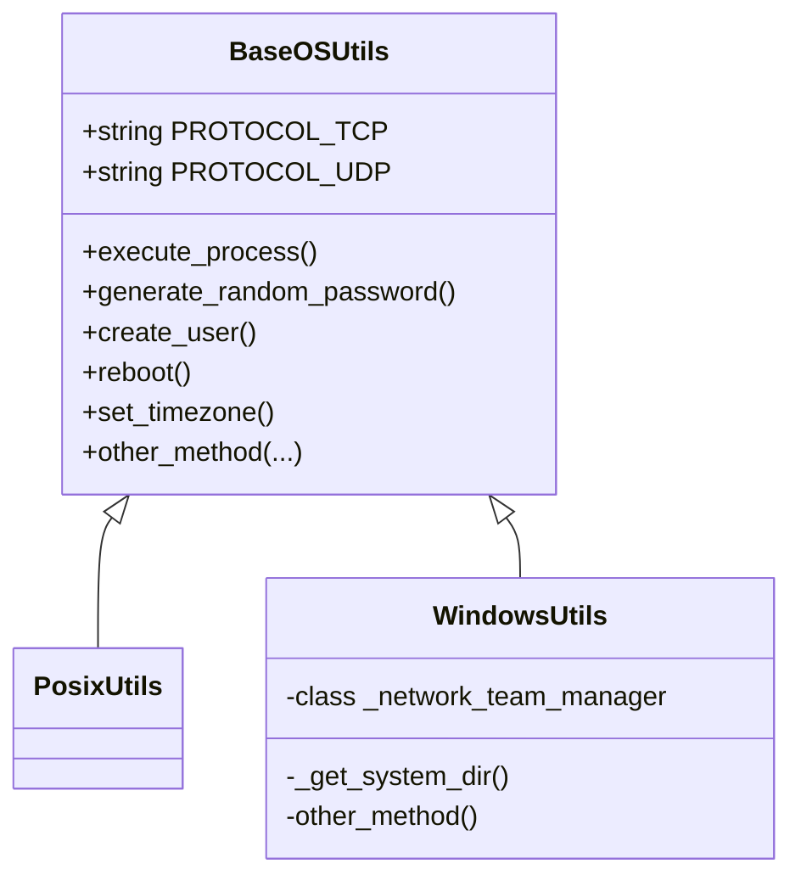
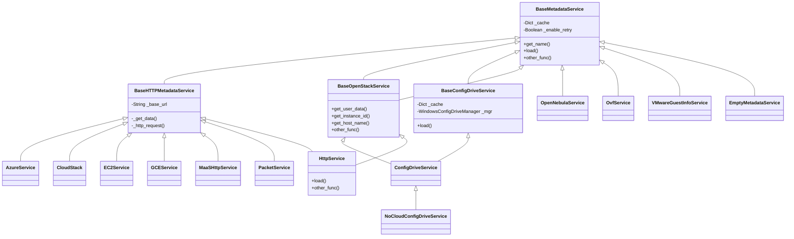
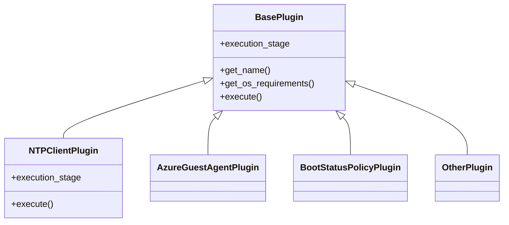

# cloud-init原理和cloudbase-init 源码研究

cloud-init是专为云环境中虚拟机的初始化而开发的工具，它从各种数据源（HTTP 或者ConfigDrive）读取相关数据并据此对虚拟机进行配置。向一台数据服务器获取元数据（meta data）和用户数据（user data），前者是指VM的必要信息，如主机名、网络地址等；后者是系统或用户需要的数据和文件，如用户组信息、启动脚本等。当cloud-init获取这些信息后，开始使用一些模块对数据进行处理，如新建用户、启动脚本等。常见的配置包括：设定虚拟机的hostname、hosts文件、设定用户名密码、更新apt -get的本地缓存等。

<!-- more -->

由于主流的操作系统（windows/linux）区别，cloudinit在不同系统的实现也是不一样的。

- windows [cloudbase-init](https://cloudbase.it/cloudbase-init/) 

  - 下载地址：https://cloudbase.it/downloads/CloudbaseInitSetup_Stable_x64.msi  
  - 在线文档: http://cloudbase-init.readthedocs.org/en/latest/

- linux [cloud-init.io](https://cloud-init.io/)

  - 下载地址：https://launchpad.net/cloud-init/+download
  - 在线文档: https://cloudinit.readthedocs.io/en/latest/index.html

  linux 当然也可以使用相应的包管理工具安装，比如`apt-get install cloud-init`

数据源：HTTP 或者ConfigDrive

- **http: 169.254.169.254**: 这个地址来源于 AWS，当年亚马逊在设计公有云的时候，为了让 instance 能够访问 metadata，就将 169.254.169.254 这个特殊的 IP 作为 metadata服务器的地址，instance 启动时就会向 169.254.169.254 请求 metadata。OpenStack 之后也沿用了这个设计，继而成为云计算业内一个默认的基本配置。
- **ConfigDrive**：ConfigDrive可以将Metadata/Userdata信息写入虚拟机的一个特殊的配置设备中，比如**CD-ROM**。在虚机启动之后，cloud-init可以从该设备中读取配置数据。

# cloud-init原理

数据服务器开启HTTP服务（或者ConfigDrive），cloud-init在虚拟机开机之后会向数据服务器发送请求，确认数据源模块，依次获取版本、数据类型和具体数据内容信息。

## http服务

在正式开始了解 169.254.169.254服务（以下称之为metadata服务）之前，需要先了解以下网络虚拟化的一些概念。

### Linux Network Namespace (netns) 

Network Namespace （以下简称netns）是Linux内核提供的一项实现网络隔离的功能，它能隔离多个不同的网络空间，并且各自拥有独立的网络协议栈，这其中便包括了网络接口（网卡），路由表，iptables规则等，例如大名鼎鼎的docker便是基于netns实现的网络隔离。

#### 使用方式

使用`ip netns help`查看使用帮助

```bash
[root@10-221-120-11 ~]# ip netns help
Usage: ip netns list
       ip netns add NAME
       ip netns set NAME NETNSID
       ip [-all] netns delete [NAME]
       ip netns identify [PID]
       ip netns pids NAME
       ip [-all] netns exec [NAME] cmd ...
       ip netns monitor
       ip netns list-id
[root@10-221-120-11 ~]# ip netns list
br_enp5s0f1_67e3541ff6b14da18e4ee99418b48add (id: 0)
```

- `ip netns list`
- `ip netns exec br_enp5s0f1_67e3541ff6b14da18e4ee99418b48add ip a`

具体例子可以参看： [Linux Network Namespace (netns) 详解](https://typesafe.cn/posts/linux-netns)

### Linux tun/tap

tun是网络层的虚拟网络设备，可以收发第三层数据报文包，如IP封包，因此常用于一些点对点IP隧道，例如OpenVPN，IPSec等。

tap是链路层的虚拟网络设备，等同于一个以太网设备，它可以收发第二层数据报文包，如以太网数据帧。Tap最常见的用途就是做为虚拟机的网卡，因为它和普通的物理网卡更加相近，也经常用作普通机器的虚拟网卡。

**TAP** 设备与 **TUN** 设备工作方式完全相同，区别在于：

1. **TUN** 设备是一个三层设备，它只模拟到了 **IP** 层，即网络层 我们可以通过 **/dev/tunX** 文件收发 **IP** 层数据包，它无法与物理网卡做 **bridge**，但是可以通过三层交换（如 **ip_forward**）与物理网卡连通。可以使用`ifconfig`之类的命令给该设备设定 **IP** 地址。
2. **TAP** 设备是一个二层设备，它比 **TUN** 更加深入，通过 **/dev/tapX** 文件可以收发 **MAC** 层数据包，即数据链路层，拥有 **MAC** 层功能，可以与物理网卡做 **bridge**，支持 **MAC** 层广播。同样的，我们也可以通过`ifconfig`之类的命令给该设备设定 **IP** 地址，你如果愿意，我们可以给它设定 **MAC** 地址。

#### 使用方式

使用`ip tuntap help`查看使用帮助

```bash
[root@10-221-120-11 ~]# ip tuntap help
Usage: ip tuntap { add | del | show | list | lst | help } [ dev PHYS_DEV ]
          [ mode { tun | tap } ] [ user USER ] [ group GROUP ]
          [ one_queue ] [ pi ] [ vnet_hdr ] [ multi_queue ] [ name NAME ]

Where: USER  := { STRING | NUMBER }
       GROUP := { STRING | NUMBER }
```

示例

```bash
# 创建 tap 
ip tuntap add dev tap0 mode tap 
# 创建 tun
ip tuntap add dev tun0 mode tun 

# 删除 tap
ip tuntap del dev tap0 mode tap
# 删除 tun
ip tuntap del dev tun0 mode tun
```

详细操作示例: [Linux tun/tap 详解](https://typesafe.cn/posts/linux-tun-tap/)

### Linux veth pair

veth pair是成对出现的一种虚拟网络设备接口，一端连着网络协议栈，一端彼此相连。如下图所示：


由于它的这个特性，常常被用于构建虚拟网络拓扑。例如连接两个不同的网络命名空间(netns)，连接docker容器，连接网桥(Bridge)等，其中一个很常见的案例就是OpenStack Neutron底层用它来构建非常复杂的网络拓扑。

#### 如何使用

创建一对veth

```bash
ip link add <veth name> type veth peer name <peer name>
```

虽然使用veth pair可以将两个隔离的netns成功的连接到了一起。但是这样的网络拓扑存在一个弊端，随着网络设备的增多，网络连线的复杂度将成倍增长。

如果连接三个netns时，网络连线就成了下图的样子：


而如果连接四个netns时，网络连线就成了下图的样子


如果有五台设备。。。

有没有什么技术可以解决这个问题呢？答案是有的，Linux Bridge（网桥）

### Linux Bridge

Linux Bridge（网桥）是用纯软件实现的虚拟交换机，有着和物理交换机相同的功能，例如二层交换，MAC地址学习等。因此我们可以把tun/tap，veth pair等设备绑定到网桥上，就像是把设备连接到物理交换机上一样。此外它和veth pair、tun/tap一样，也是一种**虚拟网络设备，具有虚拟设备的所有特性，例如配置IP，MAC地址**等。

操作网桥有多种方式，在这里我们介绍一下通过**bridge-utils**来操作，由于它不是Linux系统自带的工具，因此需要我们手动来安装它。

```bash
# centos
yum install -y bridge-utils
# 在centos7上是可以直接yum安装bridge-utils的，但是centos8不行.使用二进制安装
rpm -ivh http://mirror.centos.org/centos/7/os/x86_64/Packages/bridge-utils-1.5-9.el7.x86_64.rpm
# ubuntu
apt-get install -y bridge-utils
```

使用`brctl help`查看使用帮助

```bash
never heard of command [help]
Usage: brctl [commands]
commands:
	addbr     	<bridge>		add bridge
	delbr     	<bridge>		delete bridge
	addif     	<bridge> <device>	add interface to bridge
	delif     	<bridge> <device>	delete interface from bridge
	hairpin   	<bridge> <port> {on|off}	turn hairpin on/off
	setageing 	<bridge> <time>		set ageing time
	setbridgeprio	<bridge> <prio>		set bridge priority
	setfd     	<bridge> <time>		set bridge forward delay
	sethello  	<bridge> <time>		set hello time
	setmaxage 	<bridge> <time>		set max message age
	setpathcost	<bridge> <port> <cost>	set path cost
	setportprio	<bridge> <port> <prio>	set port priority
	show      	[ <bridge> ]		show a list of bridges
	showmacs  	<bridge>		show a list of mac addrs
	showstp   	<bridge>		show bridge stp info
	stp       	<bridge> {on|off}	turn stp on/off
```

详细操作示例：[Linux Network Namespace (netns) 详解](https://typesafe.cn/posts/linux-netns/)

> CentOS8中，已经默认不使用network.service管理网络了，默认采用NetworkManager.service管理。
>
> ```bash
> nmcli connection show  # 查看网络连接状态
> nmcli device status   # 查看网卡状态
> nmcli connection add type bridge con-name br0 ifname br0 autoconnect yes  # 创建网桥br0
> nmcli connection add type bridge-slave ifname enp7s0 master virbr0  # 将以太网接口enp7s0加入网桥br0
> 
> ```
>
> 

### 使用示例

创建一个centos8的虚拟机，使用以上网络虚拟化设备创建一个虚拟网络。拓扑图如下：


> 1. nmcli connection add type bridge con-name br0 ifname br0 autoconnect yes  # 创建bridge
>
> 2. nmcli connection add type bridge-slave ifname ens3 master br0  # 将以太网接口ens3加入网桥br0
>
> 3. nmcli connection down ens3  # 禁用以太网接口ens3
>
> 4. nmcli connection up br0  # 启用br0
>
>    至此，网桥建立成功
>
> 1. ip netns add ns0  # 新增namespace0
>
> 2. ip netns add ns1  # 新增namespace1
>
> 3. ip netns add ns2  # 新增namespace2
>
> 4. ip link add veth0-ns type veth peer name veth0-br  # 在namespace新增一对veth设备
>
> 5. ip link add veth1-ns type veth peer name veth1-br  # 在namespace新增一对veth设备
>
> 6. ip link add veth2-ns type veth peer name veth2-br  # 在namespace新增一对veth设备
>
> 7. ip link set veth0-ns netns ns0  # 将veth的一端移动到netns中
>
> 8. ip link set veth1-ns netns ns1  # 将veth的一端移动到netns中
>
> 9. ip link set veth2-ns netns ns2  # 将veth的一端移动到netns中
>
>    
>
> 10. ip netns exec ns0 ip link set lo up  # 将netns中的本地环回启动
>
> 11. ip netns exec ns0 ip link set veth0-ns up  # 启动veth设备
>
> 12. ip netns exec ns0 ip addr add 10.0.0.1/24 dev veth0-ns  # 配置veth设备ip
>
>     
>
> 13. ip netns exec ns1 ip link set lo up  # 将netns中的本地环回启动
>
> 14. ip netns exec ns1 ip link set veth1-ns up  # 启动veth设备
>
> 15. ip netns exec ns1 ip addr add 10.0.0.2/24 dev veth1-ns  # 配置veth设备ip
>
>     
>
> 16. ip netns exec ns2 ip link set lo up  # 将netns中的本地环回启动
>
> 17. ip netns exec ns2 ip link set veth2-ns up  # 启动veth设备
>
> 18. ip netns exec ns2 ip addr add 10.0.0.3/24 dev veth2-ns  # 配置veth设备ip
>
>     
>
> 19. ip link set veth0-br up  # 将veth的另一端启动
>
> 20. ip link set veth1-br up  # 将veth的另一端启动
>
> 21. ip link set veth2-br up  # 将veth的另一端启动
>
>     
>
> 22. brctl addif br0 veth0-br    # 将veth的另一端挂载到网桥上
>
> 23. brctl addif br0 veth1-br    # 将veth的另一端挂载到网桥上
>
> 24. brctl addif br0 veth2-br    # 将veth的另一端挂载到网桥上
>
> 
>
> 至此，3个namespace创建成功，并且挂载到网桥上，实现以上拓扑图。

### zstack情况探索

以上，使用tap+veth-pair+namespace+bridge实现了网络虚拟化的基本架构。我们可以根据以上知识来剖析一下zstack的虚拟网络。

1. 查看当前zstack的二层网络设置

   ```shell
   admin >>>QueryL2Network
   {
       "inventories": [
           {
               "name": "L2Network-1",
               "physicalInterface": "enp5s0f1",
               "type": "L2NoVlanNetwork",
               "uuid": "bd9e3fe3b94c45619e35e5bd9c41bee2",
               "vSwitchType": "LinuxBridge",
               #... 省略...
           }
       ],
       "success": true
   }
   admin >>>QueryL3Network 
   {
       "inventories": [
           {
               "category": "Private",
               "dns": [
                   "10.221.120.33",
                   "114.114.114.114"
               ],
               "ipRanges": [
                   {
                       "endIp": "10.221.120.250",
                       "gateway": "10.221.120.254",
                       "ipVersion": 4,
                       "l3NetworkUuid": "67e3541ff6b14da18e4ee99418b48add",
                       "lastOpDate": "Mar 14, 2022 2:19:20 PM",
                       "name": "L3Network-1",
                       "netmask": "255.255.255.0",
                       "networkCidr": "10.221.120.0/24",
                       "prefixLen": 24,
                       "startIp": "10.221.120.130",
                       "uuid": "bda973626be64225b704cae7b24d04bb"
                   }
               ],
               "ipVersion": 4,
               "l2NetworkUuid": "bd9e3fe3b94c45619e35e5bd9c41bee2",
               "name": "L3Network-1",
               #... 省略...
               "type": "L3BasicNetwork",
               "uuid": "67e3541ff6b14da18e4ee99418b48add"
           }
       ],
       "success": true
   }
   ```

   可以看到有一个二层网络`L2Network-1`和一个三层网络`L3Network-1`

2. 在服务器上查看网络硬件的配置

   ```bash
   [root@10-221-120-11 ~]# ip a
   1: lo: <LOOPBACK,UP,LOWER_UP> mtu 65536 qdisc noqueue state UNKNOWN group default qlen 1000
       link/loopback 00:00:00:00:00:00 brd 00:00:00:00:00:00
       inet 127.0.0.1/8 scope host lo
          valid_lft forever preferred_lft forever
       inet6 ::1/128 scope host 
          valid_lft forever preferred_lft forever
   2: eno1: <NO-CARRIER,BROADCAST,MULTICAST,UP> mtu 1500 qdisc mq state DOWN group default qlen 1000
       link/ether 0c:c4:7a:71:d7:0c brd ff:ff:ff:ff:ff:ff
   3: eno2: <NO-CARRIER,BROADCAST,MULTICAST,UP> mtu 1500 qdisc mq state DOWN group default qlen 1000
       link/ether 0c:c4:7a:71:d7:0d brd ff:ff:ff:ff:ff:ff
   4: enp5s0f0: <BROADCAST,MULTICAST,UP,LOWER_UP> mtu 1500 qdisc mq state UP group default qlen 1000
       link/ether 0c:c4:7a:bc:71:4a brd ff:ff:ff:ff:ff:ff
       inet6 fe80::ec4:7aff:febc:714a/64 scope link 
          valid_lft forever preferred_lft forever
   5: enp5s0f1: <BROADCAST,MULTICAST,UP,LOWER_UP> mtu 1500 qdisc mq master br_enp5s0f1 state UP group default qlen 1000
       link/ether 0c:c4:7a:bc:71:4b brd ff:ff:ff:ff:ff:ff
       inet6 fe80::ec4:7aff:febc:714b/64 scope link 
          valid_lft forever preferred_lft forever
   6: br_enp5s0f1: <BROADCAST,MULTICAST,UP,LOWER_UP> mtu 1500 qdisc noqueue state UP group default qlen 1000
       link/ether 0c:c4:7a:bc:71:4b brd ff:ff:ff:ff:ff:ff
       inet 10.221.120.11/24 scope global br_enp5s0f1
          valid_lft forever preferred_lft forever
       inet6 fe80::1c58:6dff:fe9f:2fec/64 scope link 
          valid_lft forever preferred_lft forever
   8: outer0@if7: <BROADCAST,MULTICAST,UP,LOWER_UP> mtu 65500 qdisc noqueue master br_enp5s0f1 state UP group default qlen 1000
       link/ether 82:10:7f:80:ad:9d brd ff:ff:ff:ff:ff:ff link-netnsid 0
       inet6 fe80::8010:7fff:fe80:ad9d/64 scope link 
          valid_lft forever preferred_lft forever
   9: br_conn_all_ns: <BROADCAST,MULTICAST,UP,LOWER_UP> mtu 65500 qdisc noqueue state UP group default qlen 1000
       link/ether 5e:2a:38:c8:55:cc brd ff:ff:ff:ff:ff:ff
       inet 169.254.64.1/18 scope global br_conn_all_ns
          valid_lft forever preferred_lft forever
       inet6 fe80::88a4:35ff:fe55:66a2/64 scope link 
          valid_lft forever preferred_lft forever
   11: ud_outer0@if10: <BROADCAST,MULTICAST,UP,LOWER_UP> mtu 65500 qdisc noqueue master br_conn_all_ns state UP group default qlen 1000
       link/ether 5e:2a:38:c8:55:cc brd ff:ff:ff:ff:ff:ff link-netnsid 0
       inet6 fe80::5c2a:38ff:fec8:55cc/64 scope link 
          valid_lft forever preferred_lft forever
   12: vnic375.0: <BROADCAST,MULTICAST,UP,LOWER_UP> mtu 1500 qdisc pfifo_fast master br_enp5s0f1 state UNKNOWN group default qlen 1000
       link/ether fe:1d:17:e7:ae:00 brd ff:ff:ff:ff:ff:ff
       inet6 fe80::fc1d:17ff:fee7:ae00/64 scope link 
          valid_lft forever preferred_lft forever
   13: vnic148.0: <BROADCAST,MULTICAST,UP,LOWER_UP> mtu 1500 qdisc mq master br_enp5s0f1 state UNKNOWN group default qlen 1000
       link/ether fe:e7:c3:ac:2b:00 brd ff:ff:ff:ff:ff:ff
       inet6 fe80::fce7:c3ff:feac:2b00/64 scope link 
          valid_lft forever preferred_lft forever
   # ... 省略...
   ```

   可以看到：

   1. 本机有2个网卡enp5s0f0和enp5s0f1以及本地回环lo。eno1和eno2网卡没有启动。
   2. 网卡的序号缺少一些，比如7/10等
   3. 有一些网卡名字`ud_outer0@if10`用@符号分开，这个其实就是veth pair的网卡名字特点
   4. 网卡enp5s0f1是没有ip的，但是ip转移到了 br_enp5s0f1。这个是物理网卡搭载在网桥上的一个特征。

3. 在服务器上查看网络虚拟化的配置：linux network namespace

   ```bash
   [root@10-221-120-11 ~]# ip netns list
   br_enp5s0f1_67e3541ff6b14da18e4ee99418b48add (id: 0)
   ```

   可以看到`br_enp5s0f1_67e3541ff6b14da18e4ee99418b48add`  namespace的名字的格式为：`br_{网卡名}_{三层网络uuid}`

4. 服务器上查看网络虚拟化的配置：linux bridge

   ```bash
   [root@10-221-120-11 ~]# brctl show 
   bridge name	bridge id		STP enabled	interfaces
   br_conn_all_ns		8000.5e2a38c855cc	no		ud_outer0
   br_enp5s0f1		8000.0cc47abc714b	no		enp5s0f1
   							outer0
   							vnic375.0
   							vnic148.0
   							vnic1573.0
   							# ... 省略...
   ```

5. 查看namespace内的网络情况

   ```bash
   [root@10-221-120-11 ~]# ip netns exec br_enp5s0f1_67e3541ff6b14da18e4ee99418b48add ip a
   1: lo: <LOOPBACK> mtu 65536 qdisc noop state DOWN group default qlen 1000
       link/loopback 00:00:00:00:00:00 brd 00:00:00:00:00:00
   7: inner0@if8: <BROADCAST,MULTICAST,UP,LOWER_UP> mtu 65500 qdisc noqueue state UP group default qlen 1000
       link/ether 1a:47:1c:54:8f:26 brd ff:ff:ff:ff:ff:ff link-netnsid 0
       inet 10.221.120.243/24 scope global inner0
          valid_lft forever preferred_lft forever
       inet 169.254.169.254/32 scope global inner0
          valid_lft forever preferred_lft forever
       inet6 fe80::1847:1cff:fe54:8f26/64 scope link 
          valid_lft forever preferred_lft forever
   10: ud_inner0@if11: <BROADCAST,MULTICAST,UP,LOWER_UP> mtu 65500 qdisc noqueue state UP group default qlen 1000
       link/ether d6:01:b6:5d:74:7c brd ff:ff:ff:ff:ff:ff link-netnsid 0
       inet 169.254.64.2/18 scope global ud_inner0
          valid_lft forever preferred_lft forever
       inet6 fe80::d401:b6ff:fe5d:747c/64 scope link 
          valid_lft forever preferred_lft forever
   ```

   可以看到该namespace内除了lo之外,还有2个veth pair对的其中一端：inner0和ud_inner0；inner0的对端是8号网口，ud_inner0的对端是11号网口。inner0@if8网卡配置2个ip：10.221.120.243和169.254.169.254。10.221.120.243是dhcp server地址，169.254.169.254是metadata服务的地址。

   ```bash
   [root@10-221-120-11 ~]# ip a
   # ... 省略...
   8: outer0@if7: <BROADCAST,MULTICAST,UP,LOWER_UP> mtu 65500 qdisc noqueue master br_enp5s0f1 state UP group default qlen 1000
       link/ether 82:10:7f:80:ad:9d brd ff:ff:ff:ff:ff:ff link-netnsid 0
       inet6 fe80::8010:7fff:fe80:ad9d/64 scope link 
          valid_lft forever preferred_lft forever
   # ... 省略...
   11: ud_outer0@if10: <BROADCAST,MULTICAST,UP,LOWER_UP> mtu 65500 qdisc noqueue master br_conn_all_ns state UP group default qlen 1000
       link/ether 5e:2a:38:c8:55:cc brd ff:ff:ff:ff:ff:ff link-netnsid 0
       inet6 fe80::5c2a:38ff:fec8:55cc/64 scope link 
          valid_lft forever preferred_lft forever
   
   ```

   再次查看可以发现 8号网口：outer0；11号网口：ud_outer0；分别挂载在网桥`br_enp5s0f1`上。

   根据以上的排查结果，可以画出如下的网络拓扑图：
   
   

那么我们就可以理一下整个流程：

1. 从虚拟机内部发起http请求：`http://169.254.169.254:80`

2. 根据虚拟机的路由表找到169.254.169.254的目标主机（其实是虚机所在网络的dhcp server；也即inner0）

3. 由于zstack全局做了一个nat映射

   ```bash
   [root@10-221-120-11 ~]# iptables -L -n -t nat
   Chain PREROUTING (policy ACCEPT)
   target     prot opt source               destination         
   UD-PORT-1180  all  --  0.0.0.0/0            0.0.0.0/0                
   # ... 省略...
   Chain UD-PORT-1180 (1 references)
   target     prot opt source               destination         
   DNAT       tcp  --  0.0.0.0/0            169.254.169.254      to::1180
   ```

   169.254.169.254:80端口的请求会被转发给对应的1180端口

4. 进入namespace找打对应的1080端口所监听的服务，发现是一个 lighttpd 服务。此时该请求被正确的处理，并返回response。

5. 另外需要说明一点的是，zstack的lighttpd服务会重置userdata/metadata的path

   ```ini
   url.rewrite-once = (
               # ... 省略...
               "^/.*/meta-data/(.+)$" => "/10.221.120.219/meta-data/$1",
               "^/.*/meta-data$" => "/10.221.120.219/meta-data",
               "^/.*/meta-data/$" => "/10.221.120.219/meta-data/",
               "^/.*/user-data$" => "/10.221.120.219/user-data",
               "^/.*/user_data$" => "/10.221.120.219/user_data",
               "^/.*/meta_data.json$" => "/10.221.120.219/meta_data.json",
               # ... 省略...
           )
   ```

## ConfigDrive

configdrive可以解决169.254.169.254的一个问题：网络依赖。

configdrive往往是通过CD-ROM来实现数据传输的。

通过查看openstack train版本的configdrive文档：[OpenStack Docs: Enabling the configuration drive (configdrive)](https://docs.openstack.org/ironic/train/install/configdrive.html)

> configuration drive通常用来存储一些虚拟机指定的metadata数据，在虚拟机里边一般是一个名为config-2的磁盘，通常是一个光驱。这个磁盘（光驱）最大存储64MB的数据。configuration drive一个最常用的功能是可以支持配置虚拟机网络而不需要dhcp。
>
> ## 使用Compute service(nova)启用onfiguration drive
>
> 可以在 **nova boot**命令后 `--config-drive true` 参数来启用configuration drive，如下:
>
> ```
> nova boot --config-drive true --flavor baremetal --image test-image instance-1
> ```
>
> 也可以通过配置文件 `/etc/nova/nova.conf`设置配置项来启用。使用配置文件的话， 所有的虚拟机都会自动启用configuration drive。配置参数如下：
>
> ```
> [DEFAULT]
> ...
> 
> force_config_drive=True
> ```
>
> 另外，如果想要把用户自定义的脚本也放入虚机的话，可以在**nova boot**，命令后加参数： `--user-data /path/to/file`，当然想要在虚拟机启动时执行该脚本的话还需要cloud-init的支持。

#### openstack实践

1. 配置文件不增加 `force_config_drive`配置项

2. 虚拟机启动的时候，启用参数--config-drive true。在horizon界面上操作即勾选：**Configuration Drive**

3. 虚拟机启动之后，查看其kvm-qemu的xml配置文件

   ```xml
      <disk type='file' device='disk'>
         <driver name='qemu' type='qcow2' cache='none'/>
         <source file='/var/lib/nova/instances/ad8a930e-6001-44b9-86bb-42c8a7520182/disk'/>
         <target dev='vda' bus='virtio'/>
         <address type='pci' domain='0x0000' bus='0x00' slot='0x05' function='0x0'/>
       </disk>
       <disk type='file' device='cdrom'>
         <driver name='qemu' type='raw' cache='none'/>
         <source file='/var/lib/nova/instances/ad8a930e-6001-44b9-86bb-42c8a7520182/disk.config'/>
         <target dev='hda' bus='ide'/>
         <readonly/>
         <address type='drive' controller='0' bus='0' target='0' unit='0'/>
       </disk>
   ```

   可以看到config-drive的cdrom已经挂载上了，cdrom里边挂载的文件是raw格式，路径是：/var/lib/nova/instances/ad8a930e-6001-44b9-86bb-42c8a7520182/disk.config

4. 进入虚拟机可以看到该光驱设备，该设备内的文件如下：

   ```bash
   .
   ├── ec2
   │   ├── 2009-04-04
   │   │   ├── meta-data.json
   │   │   └── user-data
   │   └── latest
   │       ├── meta-data.json
   │       └── user-data
   └── openstack
       ├── 2012-08-10
       │   ├── meta_data.json
       │   └── user_data
       ├── 2013-04-04
       │   ├── meta_data.json
       │   └── user_data
       ├── 2013-10-17
       │   ├── meta_data.json
       │   ├── user_data
       │   └── vendor_data.json
       ├── 2015-10-15
       │   ├── meta_data.json
       │   ├── network_data.json
       │   ├── user_data
       │   └── vendor_data.json
       ├── 2016-06-30
       │   ├── meta_data.json
       │   ├── network_data.json
       │   ├── user_data
       │   └── vendor_data.json
       ├── 2016-10-06
       │   ├── meta_data.json
       │   ├── network_data.json
       │   ├── user_data
       │   ├── vendor_data2.json
       │   └── vendor_data.json
       ├── 2017-02-22
       │   ├── meta_data.json
       │   ├── network_data.json
       │   ├── user_data
       │   ├── vendor_data2.json
       │   └── vendor_data.json
       ├── 2018-08-27
       │   ├── meta_data.json
       │   ├── network_data.json
       │   ├── user_data
       │   ├── vendor_data2.json
       │   └── vendor_data.json
       └── latest
           ├── meta_data.json
           ├── network_data.json
           ├── user_data
           ├── vendor_data2.json
           └── vendor_data.json
   ```

   我们一般使用openstack/latest目录下的文件内容来获取设置好的userdata+metadata。

# cloudbase-init 源码研究

cloudbase-init是cloud-init的windows版本实现，与cloudinit有一些区别，官方文档请参看[https://cloudbase-init.readthedocs.io/](https://cloudbase-init.readthedocs.io/)

以下以window10 64位+cloudbase-init 1.1.2为例。

## cloudbase-init的安装文件结构

- 源代码参见[github](https://github.com/openstack/cloudbase-init)
- 在windows系统安装之后为：
  - bin 二进制一些工具和服务启动入口
  - conf 配置文件
  - LocalScripts 本地脚本文件夹
  - log 日志目录
  - Python python环境（1.1.2版本使用的python是3.6）
    - Scripts目录下一些工具
    - Lib/site-packages 目录下安装了cloudbase-init的源码和其依赖包
    - 其他目录没有特别之处

## 打包

cloudbase-init使用pbr打包。pbr是setuptools的加强版，是openstack社区出品。使用pbr可以方便的使用git管理版本。

pbr会把setuptools的配置项转移到setup.cfg中，setup.cfg文件我们重点关注 entry_points这个设置项。entry_points可以方便为我们打包的python应用提供一个可执行的二进制文件，类似于`pip install` 和 `python -m pip intstall`的关系。在cloudbase-init中，通过pbr打包，会生成cloudbase-init.exe，位于：Cloudbase-Init\Python\Scripts目录下，cloudbase-init运行的时候，可以直接调用该二进制文件。

## 入口

cloudbase-init安装完成之后，会在windows注册一个cloudbase-init的服务,通过查看其服务属性的可执行路径：

> "C:\Program Files\Cloudbase Solutions\Cloudbase-Init\bin\OpenStackService.exe" cloudbase-init "C:\Program Files\Cloudbase Solutions\Cloudbase-Init\Python\Scripts\cloudbase-init.exe" --config-file "C:\Program Files\Cloudbase Solutions\Cloudbase-Init\conf\cloudbase-init.conf"

调用`cloudbase-init.exe`传参`--config-file cloudbase-init.conf`;

其中 `cloudbase-init.exe`就是我们cloudbase-init项目使用pbr打包出来的可执行文件的入口。这个文件是pbr的entry_points控制生成的。entry_points的设置为：

```ini
[entry_points]
console_scripts =
  cloudbase-init = cloudbaseinit.shell:main
```

所以，可以知道cloudbase-init项目的入口是cloudbase-init下的**shell.py**.


## 源码分析

从git clone下代码之后，主要源码位于/cloudbase-init目录下：

- cloudbase-init
  - conf
  - metadata
  - models
  - osutils
  - plugins
  - tests
  - utils
  - `__init__.py`
  - constant.py
  - exception.py
  - init.py
  - shell.py
  - version.py

### osutils



osutils 使用了**简单工厂**设计模式，根据当前操作系统的类型来加载相应的类，并创建对应的对象。

```python
def get_os_utils():
    osutils_class_paths = {
        'nt': 'cloudbaseinit.osutils.windows.WindowsUtils',
        'posix': 'cloudbaseinit.osutils.posix.PosixUtils'
    }

    cl = classloader.ClassLoader()
    return cl.load_class(osutils_class_paths[os.name])()
```

`os.name`的返回值是posix，nt，java之一，分别代表linux/windows/java虚拟机。

cloudbase-init主要针对windows环境，所以WindowsUtils实现的比较健全，PosixUtils只实现了reboot方法。

### shell.py

shell.py是cloudbase-init的入口文件，提供3个功能：

1. 读取配置文件。通过command line参数读取配置文件位置，使用oslo.config加载配置文件。配置文件一般位于：Cloudbase-Init/conf目录下
2. 初始化log
3. 进入cloudbase-init的主程序：init.py，执行`init.InitManager().configure_host()`

### init.py

init.py只有一个public方法，`configure_host`。该方法的逻辑如下：

1. 查看配置项`reset_service_password`是否为true， 为true则需要先修改cloudbase-init服务用户的密码。如果cloudbase-init使用的是系统内置用户（比如Administrator）或者是域用户则跳过修改，密码为长度20的随机字符串。如果设置自动修改密码，可以避免克隆虚机时，密码泄露。

2. 等待修改密码并重启完成。重启完成的标志是注册表`HKEY_LOCAL_MACHINE\System\Setup\Status\SysprepStatus\GeneralizationState`为7

3. 开始执行PRE_NETWORKING阶段plugin，PRE_NETWORKING阶段的plugin只有`cloudbaseinit.plugins.windows.ntpclient.NTPClientPlugin`，如果NTPClientPlugin不在cloudbase-init.conf的plugins配置项内出现，则跳过。NTPClientPlugin具体逻辑请参看plugins章节。

4. 如果需要检查版本，需要到官网地址`https://www.cloudbase.it/checkupdates.php`获取最新版本并输出日志

5. 开始执行PRE_METADATA_DISCOVERY阶段plugin，PRE_METADATA_DISCOVERY阶段的plugin只有`cloudbaseinit.plugins.common.mtu.MTUPlugin`，如果MTUPlugin不在cloudbase-init.conf的plugins配置项内出现，则跳过。MTUPlugin具体逻辑请参看plugins章节。

6. 判断PRE_NETWORKING和PRE_METADATA_DISCOVERY阶段是否有立刻重启的返回值（比如如果设置了RTC，就需要重启），如果有就执行重启

7. 如果不需要重启，那么开始执行metadata service。

8. **简单工厂**方式加载配置文件`metadata_services`选项指定的services，循环执行service的load方法，只要有任何一个load方法正确执行，则返回当前service，停止循环；如果所有的load方法都执行失败，则抛出异常：No available service found，此后MAIN阶段的plugin不会执行。

   service的load方法有5个：

   1. `HttpService.load()`  具体查看http service章节
   2. `ConfigDriveService.load()` 使用平台适配的configDriveManager获取存储介质（ cd-rom）内的metadata数据
   3. `VMwareGuestInfoService.load()`使用rpc获取metadata/userdata数据
   4. `OpenNebulaService.load()`从 cd-rom读取context.sh文件
   5. `OvfService.load()`

9. 如果开启`metadata_report_provisioning_started`，则需要进行服务状态汇报，目前只有AzureService需要。`metadata_report_provisioning_started`是把当前cloudinit的状态（state=NotReady;Substate=Provisioning）回报给AzureService。

10. 获取instance__uuid，准备用来保存每个plugin执行的结果。

11. 执行MAIN阶段的plugins。**简单工厂**方式加载配置文件`plugins`选项指定的plugins，并且循环执行所有plugin的excute方法。根据excute的返回值来记录plugin的状态和是否需要重启，有任何一个plugin需要重启，则break循环。

12. 如果开启`metadata_report_provisioning_completed`并且执行失败，则需要进行服务状态（state=NotReady;Substate=ProvisioningFailed）汇报，目前只有AzureService需要。

13. 根据plugins的返回结果，判断是否需要重启

14. 如果开启`metadata_report_provisioning_completed`并且执行成功，则需要进行服务状态（state=Ready）汇报，目前只有AzureService需要。

15. 判断`stop_service_on_exit==True`程序退出结束，默认是true。

### conf

包含了cloudbase-init的配置文件提供的配置项。使用了oslo.config第三方包，并且使用oslo.log作为日志工具，oslo.log会自动引入以下配置项，具体每一项的含义参看cloudbase-init的[文档](https://cloudbase-init.readthedocs.io/en/latest/config.html)：

```ini
debug
log_config_append
log_date_format
log_file
log_dir
watch_log_file
use_syslog
use_journal
syslog_log_facility
use_json
use_stderr
use_eventlog
log_rotate_interval
log_rotate_interval_type
max_logfile_count
max_logfile_size_mb
log_rotation_type
logging_context_format_string
logging_default_format_string
logging_debug_format_suffix
logging_exception_prefix
logging_user_identity_format
default_log_levels
publish_errors
```

除了log相关的配置项之外，还有一些其他配置，如azure/openstack等平台的特殊参数，我们主要关注的参数位于`conf/default.py`内，以下几个参数比较重要，其他的请参看[官方文档](https://cloudbase-init.readthedocs.io/en/latest/config.html)：

- local_scripts_path：本地脚本目录。我们可以在这个目录下放置一些脚本（powershell/python/cmd shell），cloudbase-init会执行该目录下的脚本。比如小酷云版本实现的自动格式化数据盘功能就是一个python的脚本。

- metadata_services：已启用的元数据服务类的列表，将按列表的顺序测试其可用性。第一个可用的服务将用于检索元数据，并缓存元数据；之后的plugin可以从缓存获取数据。

- plugins：启用的插件来列表，将按照列表顺序依次执行。插件根据加载的metadata service获取的元数据执行操作。

### metadata service




metadata （元数据）服务有：

1. cloudbaseinit.metadata.services.httpservice
2. cloudbaseinit.metadata.services.configdrive.ConfigDriveService
3. cloudbaseinit.metadata.services.nocloudservice.NoCloudConfigDriveService
4. cloudbaseinit.metadata.services.ec2service.EC2Service
5. cloudbaseinit.metadata.services.cloudstack.CloudStack
6. cloudbaseinit.metadata.services.opennebulaservice.OpenNebulaService
7. cloudbaseinit.metadata.services.maasservice.MaaSHttpService
8. cloudbaseinit.metadata.services.ovfservice.OvfService
9. cloudbaseinit.metadata.services.packet.PacketService
10. cloudbaseinit.metadata.services.azureservice.AzureService
11. cloudbaseinit.metadata.services.base.EmptyMetadataService
12. cloudbaseinit.metadata.services.vmwareguestinfoservice.VMwareGuestInfoService
13. cloudbaseinit.metadata.services.gceservice.GCEService

#### httpservice[openstack]

HttpService和EC2Service、MaaSHttpService、GCEService、PacketService、AzureService以及CloudStack使用了相同的基类BaseHTTPMetadataService，这几个服务都是基于http服务获取metadata数据的，每个具体的service获取metadata方法略有区别，以下主要说明HttpService，也即openstack 系 HttpService。

- httpService一般用来做Openstack系 metadata 获取，一般metadata数据所在的http地址是：`http://169.254.169.254:80`，这个地址可以通过配置文件的`metadata_base_url`来设置。这个特殊的地址最初是由亚马逊的虚拟计算服务提出的，后由各大厂商继承发展，逐渐成为一个业内通用的做法。这个服务可以提供以下数据：
  - instance id： 虚机的uuid
  - hostname： 虚机的计算机名字
  - public keys： ca证书
  - [WinRM](https://docs.microsoft.com/en-us/windows/win32/winrm/authentication-for-remote-connections#client-certificate-based-authentication) authentication certificates
  - static network configuration： 静态网络地址配置
  - admin user password： admin用户的密码
  - post admin user password (only once)
  - user data：user data数据

- 与这个服务相关的配置项有：
  - metadata_base_url (string: “http://169.254.169.254/”)
  - add_metadata_private_ip_route (bool: True)
  - https_allow_insecure (bool: False)
  - https_ca_bundle (string: None)
  - retry_count (integer: 5)
  - retry_count_interval (integer: 4)
- 代码逻辑
  - 由init.py的代码逻辑可以看出，service加载的时候，首先执行service的`__init__`，其次执行其`load()`方法。
  - httpService的`__init__`方法主要完成了`base_url`设置，`base_url`一般是`http://169.254.169.254/`，可以通过配置文件`metadata_base_url`修改
  - load方法主要逻辑为
    - 【可选】设置静态路由，比如`169.254.169.254  255.255.255.255   10.221.120.206(网关)   10.221.120.131(本机网卡)      6(跃点数) `
    - 获取metadata数据，metadata数据路径为：`http://169.254.169.254/openstack/latest/meta_data.json`。
      - zstack平台使用lighttpd作为http server服务，每创建一个虚机，就会在lighttpd的web root目录下添加一个以该虚机IP为名字的目录，目录内放置user_data和meta_data数据。但是如果没有设置虚机的userdata参数，那么zstack不会在lighttpd下创建meta_data数据。所以，在zstack平台，如果需要cloudbase-init成功执行，userdata必须设置，哪怕是一个空字符串。

#### ConfigDriveService[openstack]

ConfigDriveService可以支持cloudbase-init从一个挂载在虚机的磁盘获取metadata数据而不需要网络连接，通常这种获取metadata数据的方式会比http更快。 支持ConfigDrive的hypervisors包括 libvirt, XenServer, Hyper-V和VMware。这个磁盘可以是以下类型：

- cdrom_iso

- hdd_iso

- hdd_vfat

- partition_iso

- partition_vfat

  这里的5种磁盘格式是由cloudbase-init配置文件的`types`和`locations`字段控制的。

  - `types`：提供metadata数据的磁盘格式。可选值是vfat和iso。
    - vfat，文件分配表（File Allocation Table，FAT），是一种由微软发明并拥有部分专利的文件系统，FAT已被大多数的操作系统支持（包括linux/freeBSD/BeOS）。FAT16性能有限，现在，一般所讲的FAT专指FAT32。VFAT是对基本FAT文件系统的改进，允许为每个文件存储更多信息。vfat格式一般用来做兼容性的设置，默认建议使用iso。另外，在openstack中，vfat格式会限制磁盘大小为64M，详见[openstack config drive user guide](https://docs.openstack.org/nova/queens/user/config-drive.html)。
    - iso，ISO-9660，简称ISO，是通用的光盘文件系统。需要用光驱的方式加载，以kvm方式来说，就是给虚机添加一个cdrom的设备。文件是只读的。
  - `locations`: 提供metadata数据的磁盘的位置。可选值是cdrom/hdd/partition。
    - cdrom: 光驱。光驱设备只能加载iso文件，所以当`locations`是cdrom时，`types`只能是iso。
    - hdd: hard disk drive，硬盘驱动。
    - partition: 分区或者卷（volume）

>  ConfigDriveService挂载的设备名称默认为`config-2`,metadata文件路径为`openstack\latest\meta_data.json`。

另外值得一提的是，configdrive使用简单工厂模式加载`ConfigDriveManager`，该manager封装了从挂载的设备中读取数据的方法，比如：

- get_config_drive_from_cdrom_drive
- get_config_drive_from_raw_hdd
- get_config_drive_from_vfat
- get_config_drive_from_partition
- get_config_drive_from_volume

> 只支持windows平台。

这个服务可以提供以下数据：

- instance id： 虚机的uuid
- hostname： 虚机的计算机名字
- public keys： ca证书
- authentication certificates
- static network configuration： 静态网络地址配置
- admin user password： admin用户的密码
- user data：user data数据

与这个服务相关的配置项有：

- ~~raw_hdd (bool: True) 将要被弃用~~
- ~~cdrom (bool: True)将要被弃用~~
- ~~vfat (bool: True)将要被弃用~~
- types (list: [“vfat”, “iso”])
- locations (list: [“cdrom”, “hdd”, “partition”])

### plugins




plugins根据加载的metadata service获取的元数据执行操作。plugins执行的时候分成三个阶段：

1. PRE_NETWORKING：在任何基于网络请求的操作之前执行，用来设置网络。
2. PRE_METADATA_DISCOVERY：在metadata 数据获取之前执行前执行的一些操作。
3. MAIN：MAIN阶段执行前，需要metadata service先要获取到当前虚机的instance uuid，instance uuid用来保存每次plugin执行之后的状态（1:执行完成，下次开机跳过。2：下次开机执行）。如果metadata service获取instance uuid过程正常，但是没有得到正确的uuid，比如instance uuid是`None`，那么每次开机plugins都会执行。但是如果metadata service获取instance uuid过程都出错，比如`169.254.169.254`地址不通，那么**所有的plugin都不会执行**。

每一个阶段内的每个子元素（metada/plugin）都可以设置执行结果的code。

- 1001 - 立刻重启，并且下次重启不再执行
- 1002 - 现在不重启，下次重启再次执行该plugin
- 1003 - 重启并且下次开机再次执行

##### PRE_NETWORKING

 PRE_NETWORKING阶段执行的plugin只有一个：时钟同步

1. cloudbaseinit.plugins.windows.ntpclient.NTPClientPlugin
   - 支持的配置项有：
     - ntp_use_dhcp_config (bool: False)是否使用dhcp server提供的NTP来同步时钟，默认是false。
     - real_time_clock_utc (bool: False)是否修改RTC时间。
     - ntp_enable_service (bool: True)是否启用ntp自动同步，默认开启
   - 注意：
     - 可能需要重启（比如修改RTC时间）.
     - 可能每次开机都运行（比如启用dhcp方式，但是本次获取dhcp数据失败，下次开机继续尝试）。
   - NTPClientPlugin代码逻辑
     - 检查NTPClientPlugin的系统要求：`sys.platform`和`min_os_version`;windows平台下`sys.platform`返回值为win32/linux/cygwin/darwin分别对应windows/linux/"Windows/Cygwin"/Mac OS X。 NTPClientPlugin对这2这者都不做要求。
     - 执行NTPClientPlugin。判断注册表HKEY_LOCAL_MACHINE目录下路径为`SOFTWARE/Cloudbase Solutions/Cloudbase-Init/[instance_uuid]/Plugins/NTPClientPlugin`的value，如果value是1（PLUGIN_EXECUTION_DONE）则代表该plugin已经执行成功，不再执行。否则执行NTPClientPlugin的execute方法。
     - 执行NTPClientPlugin的execute方法。判断是否使用dhcp来同步时间、是否启用NTP、是否修改当前RTC时间格式为UTC(需要重启)。
     - Plugin返回本次执行结果[PLUGIN_EXECUTION_DONE(1)|PLUGIN_EXECUTE_ON_NEXT_BOOT(2)]和是否需要重启

##### PRE_METADATA_DISCOVERY

PRE_METADATA_DISCOVERY阶段执行的plugin只有一个：设置MTU

1. cloudbaseinit.plugins.common.mtu.MTUPlugin
   - 支持的配置项有：
     - mtu_use_dhcp_config (bool: True)使用dhcp server提供的MTU参数设置网络。OpenStack GRE Neutron Open vSwitch可能会需要设置这个参数。
   - 注意：
     - 每次开机都运行
   - MTUPlugin代码逻辑
       - mtu参数需要获取当前虚机网卡属性中的`dhcp_server`，通过dhcp server的ip，发送socket数据包，从回执消息中得到MTU的value.
       - 设置mtu值。windows XP和Windows Server 2003不支持设置MTU。使用python的`subprocess.Popen`执行`netsh.exe`命令来设置MTU。
       - plugin返回 PLUGIN_EXECUTE_ON_NEXT_BOOT（2），无需立刻重启。所以每次虚机开机都会去尝试执行设置MTU。

##### MAIN

MAIN阶段官方提供的plugin如下，分别是：

1. cloudbaseinit.plugins.common.ephemeraldisk.EphemeralDiskPlugin

2. cloudbaseinit.plugins.common.localscripts.LocalScriptsPlugin

   执行本地目录下（配置项local_scripts_path）的脚本，脚本支持 powershell, batch, python等。脚本的返回值可以设置相应的code(1001/1002/1003)来控制是否重启继续执行。

   - 重启策略：根据脚本返回值决定

3. cloudbaseinit.plugins.common.networkconfig.NetworkConfigPlugin

4. cloudbaseinit.plugins.common.sethostname.SetHostNamePlugin

5. cloudbaseinit.plugins.common.setuserpassword.SetUserPasswordPlugin

6. cloudbaseinit.plugins.common.sshpublickeys.SetUserSSHPublicKeysPlugin

7. cloudbaseinit.plugins.common.trim.TrimConfigPlugin

8. cloudbaseinit.plugins.common.userdata.UserDataPlugin

   userdata可以由虚机的创建者或者虚拟化平台自定义，目的是能够把虚机外部的一些参数传进虚机内部，做一些定制化修改。

   userdata的文件内容一般会在第一行指定以哪种方式执行：Batch、PowerShell、bash、Python、EC2 format、Cloud config。具体参看[官方文档](https://cloudbase-init.readthedocs.io/en/latest/userdata.html#)

   - 重启策略：根据脚本返回值决定
   - 代码逻辑
     - UserDataPlugin核心代码是excute方法。首先通过成功加载的第一个service获取userdata数据，路径是：：`http://169.254.169.254/openstack/latest/user_data`
     - 如果设置了`userdata_save_path`保存user_data到本地
     - 读取user_data header，识别user data的格式，以及确定使用哪种方式执行。支持的方式有：
       - MIME multi-part类型，可以使用jinja2模板渲染内容
       - `-----BEGIN CERTIFICATE-----`开头的PEM certificate类型
       - `#cloud-config`开头的类型
       - 其他类型
         - 先另存user_data数据到临时目录（临时目录根据环境变量'TMPDIR', 'TEMP', 'TMP'依次获取），并使用一个uuid作为名字，文件名的后缀根据user_data获取，user_data临时文件绝对路径为：`$TEMP/$uuid.<后缀>`：
           - `rem cmd`使用`.cmd`后缀
           - `python`使用`.py`后缀
           - `PowerShell`使用`.ps1`后缀
           - 其他的以`#!`开头的使用`.sh`后缀
           - EC2 format无后缀
         - 使用`subprocess.Popen`来执行具体的命令
         - 简单工厂模式获取当前类型以及对应的执行该类型脚本的命令。按照以下顺序依次匹配：
           - 开头有`rem cmd`执行`subprocess.Popen($TEMP/$uuid.cmd, shell=True)`
           - 开头有`#!/usr/bin/env python`执行`subprocess.Popen(python $TEMP/$uuid.py, shell=False)`
           - 开头有`#!`使用`subprocess.Popen`执行`subprocess.Popen(bash $TEMP/$uuid.sh, shell=False)`
           - 开头有`#ps1`或者`#ps1_sysnative`使用`subprocess.Popen`执行`subprocess.Popen('powershell.exe路径' $TEMP/$uuid.ps1, shell=False)`
           - 开头有`#ps1_x86`(Windows On Windows 32bit)使用`subprocess.Popen`执行`subprocess.Popen('powershell.exe路径' $TEMP/$uuid.ps1, shell=False)`
           - user_data内容有`<script>一些内容</script>`和`<powershell>一些内容</powershell>`这样的标记，使用EC2 format处理。EC2 format其实还是解析内容，再分成bash 和powershell_sysnative方式处理。

9. cloudbaseinit.plugins.windows.azureguestagent.AzureGuestAgentPlugin

10. cloudbaseinit.plugins.windows.bootconfig.BCDConfigPlugin

11. cloudbaseinit.plugins.windows.bootconfig.BootStatusPolicyPlugin

12. cloudbaseinit.plugins.windows.certificates.ServerCertificatesPlugin

13. cloudbaseinit.plugins.windows.createuser.CreateUserPlugin

14. cloudbaseinit.plugins.windows.displayidletimeout.DisplayIdleTimeoutConfigPlugin

15. cloudbaseinit.plugins.windows.extendvolumes.ExtendVolumesPlugin

    自动扩容磁盘。当磁盘的容量有变更时，虚机开机会自动扩容。比如虚机创建时设置的磁盘为40G, 在虚拟化平台扩容为100G，那么虚机开机之后，会自动扩容磁盘为100G。否则的话，磁盘设备会有一个60G的数据空间为未分配。

    - 重启策略：每次开机执行

16. cloudbaseinit.plugins.windows.licensing.WindowsLicensingPlugin

17. cloudbaseinit.plugins.windows.pagefiles.PageFilesPlugin

18. cloudbaseinit.plugins.windows.rdp.RDPPostCertificateThumbprintPlugin

19. cloudbaseinit.plugins.windows.rdp.RDPSettingsPlugin

20. cloudbaseinit.plugins.windows.sanpolicy.SANPolicyPlugin

21. cloudbaseinit.plugins.windows.updates.WindowsAutoUpdatesPlugin

22. cloudbaseinit.plugins.windows.winrmcertificateauth.ConfigWinRMCertificateAuthPlugin

23. cloudbaseinit.plugins.windows.winrmlistener.ConfigWinRMListenerPlugin

##  总结

- cloudbase-init 善于使用抽象/继承、简单工厂模式来组织项目代码。代码看起来井井有条，值得借鉴。
- 封装了很多windows系统上使用python实现的一些方法，比如获取网络信息/设置MTU/设置计算机名等。与windows的交互使用的是ctypes这个第三方库，它提供了与 C 兼容的数据类型，并允许调用 DLL 或共享库中的函数。可使用该模块以纯 Python 形式对这些库进行封装。
- pbr/setuptools等打包方式也可以借鉴。


# 参考文献

- [Linux Network Namespace (netns) 详解](https://typesafe.cn/posts/linux-netns)
- [Linux tun/tap 详解 | 没有理想的人不伤心 (typesafe.cn)](https://typesafe.cn/posts/linux-tun-tap/))

