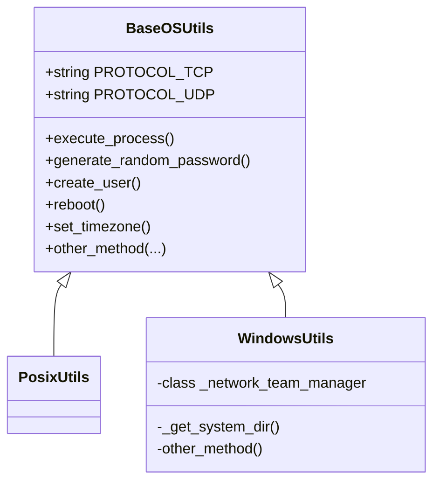
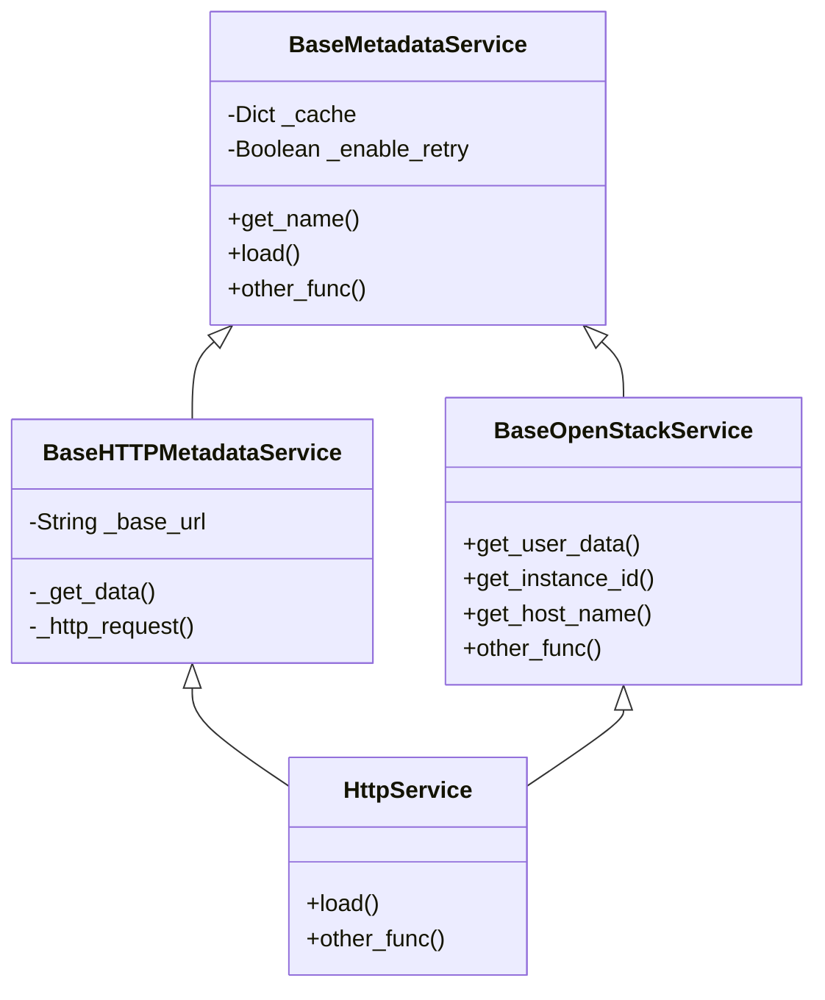
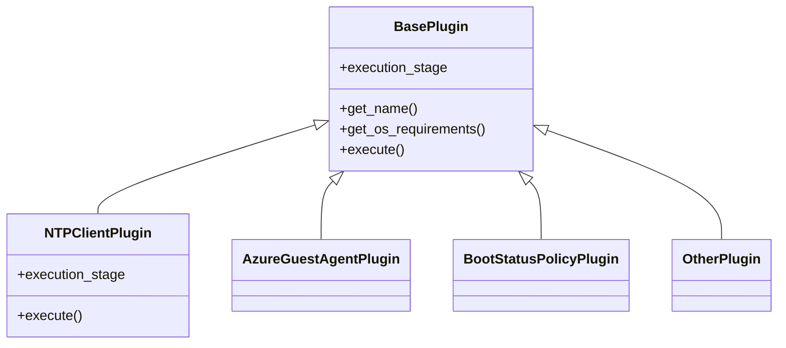

# cloudbase-init 源码研究

cloudbase-init是cloud-init的windows版本实现，与cloudinit有一些区别，官方文档请参看[https://cloudbase-init.readthedocs.io/](https://cloudbase-init.readthedocs.io/)
<!-- more -->

以下以window10 64位+cloudbase-init 1.1.2为例。

## cloudbase-init的安装文件结构

- 源代码参见[github](https://github.com/openstack/cloudbase-init)
- 在windows系统安装之后为：
  - bin 二进制一些工具和服务启动入口
  - conf 配置文件
  - LocalScripts 本地脚本文件夹
  - log 日志目录
  - Python python环境（1.1.2版本使用的python是3.6）
    - Scripts目录下一些工具
    - Lib/site-packages 目录下安装了cloudbase-init的源码和其依赖包
    - 其他目录没有特别之处

## 打包

cloudbase-init使用pbr打包。pbr是setuptools的加强版，是openstack社区出品。使用pbr可以方便的使用git管理版本。

pbr会把setuptools的配置项转移到setup.cfg中，setup.cfg文件我们重点关注 entry_points这个设置项。entry_points可以方便为我们打包的python应用提供一个可执行的二进制文件，类似于`pip install` 和 `python -m pip intstall`的关系。在cloudbase-init中，通过pbr打包，会生成cloudbase-init.exe，位于：Cloudbase-Init\Python\Scripts目录下，cloudbase-init运行的时候，可以直接调用该二进制文件。

## 入口

通过打包章节可以知道cloudbase-init的执行文件为Cloudbase-Init\Python\Scripts\cloudbase-init.exe，这个文件是pbr的entry_points控制生成的。entry_points的设置为：

```ini
[entry_points]
console_scripts =
  cloudbase-init = cloudbaseinit.shell:main
```

所以，可以知道cloudbase-init项目的入口是cloudbase-init下的**shell.py**.


## 源码分析

从git clone下代码之后，主要源码位于/cloudbase-init目录下：

- cloudbase-init
  - conf
  - metadata
  - models
  - osutils
  - plugins
  - tests
  - utils
  - `__init__.py`
  - constant.py
  - exception.py
  - init.py
  - shell.py
  - version.py

### osutils



osutils 使用了**简单工厂**设计模式，根据当前操作系统的类型来加载相应的类，并创建对应的对象。

```python
def get_os_utils():
    osutils_class_paths = {
        'nt': 'cloudbaseinit.osutils.windows.WindowsUtils',
        'posix': 'cloudbaseinit.osutils.posix.PosixUtils'
    }

    cl = classloader.ClassLoader()
    return cl.load_class(osutils_class_paths[os.name])()
```

`os.name`的返回值是posix，nt，java之一，分别代表linux/windows/java虚拟机。

cloudbase-init主要针对windows环境，所以WindowsUtils实现的比较健全，PosixUtils只实现了reboot方法。

### shell.py

shell.py是cloudbase-init的入口文件，提供3个功能：

1. 读取配置文件。通过command line参数读取配置文件位置，使用oslo.config加载配置文件。配置文件一般位于：Cloudbase-Init/conf目录下
2. 初始化log
3. 进入cloudbase-init的主程序：init.py，执行`init.InitManager().configure_host()`

### init.py

init.py只有一个public方法，`configure_host`。该方法的逻辑如下：

1. 查看配置项`reset_service_password`是否为true， 为true则需要先修改cloudbase-init服务用户的密码。如果cloudbase-init使用的是系统内置用户（比如Administrator）或者是域用户则跳过修改，密码为长度20的随机字符串。设置自动修改密码，可以避免克隆虚机时，密码泄露。
2. 等待修改密码并重启完成
3. 开始执行PRE_NETWORKING阶段plugin，PRE_NETWORKING阶段的plugin只有`cloudbaseinit.plugins.windows.ntpclient.NTPClientPlugin`，如果NTPClientPlugin不在cloudbase-init.conf的plugins配置项内出现，则跳过。NTPClientPlugin具体逻辑请参看plugins章节。
4. 如果需要检查版本，需要到官网地址`https://www.cloudbase.it/checkupdates.php`获取最新版本并输出日志
5. 开始执行PRE_METADATA_DISCOVERY阶段plugin，PRE_METADATA_DISCOVERY阶段的plugin只有`cloudbaseinit.plugins.common.mtu.MTUPlugin`，如果MTUPlugin不在cloudbase-init.conf的plugins配置项内出现，则跳过。MTUPlugin具体逻辑请参看plugins章节。
6. 判断PRE_NETWORKING和PRE_METADATA_DISCOVERY阶段是否有立刻重启的返回值（比如如果设置了RTC，就需要重启），如果有就执行重启
7. 如果不需要重启，那么开始执行metadata service。
8. **简单工厂**方式加载配置文件`metadata_services`选项指定的services，循环执行service的load方法，只要有任何一个load方法正确执行，则返回当前service，停止循环；如果所有的load方法都执行失败，则抛出异常：No available service found，此后MAIN阶段的plugin不会执行。
9. 如果开启`metadata_report_provisioning_started`，则需要进行服务状态汇报，目前只有AzureService需要。
10. 获取instance__uuid，用来保存每个plugin执行的结果。
11. 执行MAIN阶段的plugins。**简单工厂**方式加载配置文件`plugins`选项指定的plugins，并且循环执行所有plugin的excute方法。根据excute的返回值来记录plugin的状态和是否需要重启，有任何一个plugin需要重启，则break循环。
12. 如果开启`metadata_report_provisioning_completed`并且执行失败，则需要进行服务状态汇报，目前只有AzureService需要。
13. 根据plugins的返回结果，判断是否需要重启
14. 如果开启`metadata_report_provisioning_completed`并且执行成功，则需要进行服务状态汇报，目前只有AzureService需要。
15. 程序结束

### conf

包含了cloudbase-init的配置文件提供的配置项。使用了oslo.config第三方包，并且使用oslo.log作为日志工具，oslo.log会自动引入以下配置项，具体每一项的含义参看cloudbase-init的[文档](https://cloudbase-init.readthedocs.io/en/latest/config.html)：

```
debug
log-config-append
log-date-format
log-file
log-dir
watch-log-file
use-syslog
use-journal
syslog_log_facility
use_json
use_stderr
use_eventlog
log_rotate_interval
log_rotate_interval_type
max_logfile_count
max_logfile_size_mb
log_rotation_type
logging_context_format_string
logging_default_format_string
logging_debug_format_suffix
logging_exception_prefix
logging_user_identity_format
default_log_levels
publish_errors
```

除了log相关的配置项之外，还有一些其他配置，如azure/openstack等平台的特殊参数，我们主要关注的参数位于`conf/default.py`内，以下几个参数比较重要，其他的请参看[官方文档](https://cloudbase-init.readthedocs.io/en/latest/config.html)：

local_scripts_path：本地脚本目录。我们可以在这个目录下放置一些脚本（powershell/python/cmd shell），cloudbase-init会执行该目录下的脚本。比如小酷云版本实现的自动格式化数据盘功能就是一个python的脚本。

metadata_services：已启用的元数据服务类的列表，将按列表的顺序测试其可用性。第一个可用的服务将用于检索元数据，并缓存元数据；之后的service可以从缓存获取数据。

plugins：启用的插件来列表，将按照列表顺序依次执行。插件根据加载的metadata service获取的元数据执行操作。

### metadata service



metadata （元数据）服务有：

1. cloudbaseinit.metadata.services.httpservice
2. cloudbaseinit.metadata.services.configdrive.ConfigDriveService
3. cloudbaseinit.metadata.services.nocloudservice.NoCloudConfigDriveService
4. cloudbaseinit.metadata.services.ec2service.EC2Service
5. cloudbaseinit.metadata.services.cloudstack.CloudStack
6. cloudbaseinit.metadata.services.opennebulaservice.OpenNebulaService
7. cloudbaseinit.metadata.services.maasservice.MaaSHttpService
8. cloudbaseinit.metadata.services.ovfservice.OvfService
9. cloudbaseinit.metadata.services.packet.PacketService
10. cloudbaseinit.metadata.services.azureservice.AzureService
11. cloudbaseinit.metadata.services.base.EmptyMetadataService
12. cloudbaseinit.metadata.services.vmwareguestinfoservice.VMwareGuestInfoService
13. cloudbaseinit.metadata.services.gceservice.GCEService

#### httpservice[openstack]

HttpService和EC2Service、MaaSHttpService以及CloudStack使用了相同的基类BaseHTTPMetadataService，这4个服务都是基于http服务获取metadata数据的。

- httpService一般用来做Openstack metadata 获取，一般metadata数据所在的http地址是：`http://169.254.169.254:80`，这个地址可以通过配置文件的`metadata_base_url`来设置。这个特殊的地址最初是由亚马逊的虚拟计算服务提出的，后由各大厂商继承发展，逐渐成为一个业内通用的做法。这个服务可以提供以下数据：
  - instance id： 虚机的uuid
  - hostname： 虚机的计算机名字
  - public keys： ca证书
  - [WinRM](https://docs.microsoft.com/en-us/windows/win32/winrm/authentication-for-remote-connections#client-certificate-based-authentication) authentication certificates
  - static network configuration： 静态网络地址配置
  - admin user password： admin用户的密码
  - post admin user password (only once)
  - user data：user data数据

- 与这个服务相关的配置项有：
  - metadata_base_url (string: “http://169.254.169.254/”)
  - add_metadata_private_ip_route (bool: True)
  - https_allow_insecure (bool: False)
  - https_ca_bundle (string: None)
  - retry_count (integer: 5)
  - retry_count_interval (integer: 4)
- 代码逻辑
  - 由init.py的代码逻辑可以看出，service加载的时候，首先执行service的`__init__`，其次执行其`load()`方法。
  - httpService的`__init__`方法主要完成了`base_url`设置，`base_url`一般是`http://169.254.169.254/`，可以通过配置文件`metadata_base_url`修改
  - load方法主要逻辑为
    - 设置静态路由，比如`169.254.169.254  255.255.255.255   10.221.120.206(网关)   10.221.120.131(本机网卡)      6(跃点数) `
    - 获取metadata数据，metadata数据路径为：`http://169.254.169.254/openstack/latest/meta_data.json`。
      - zstack平台使用lighttpd作为http server服务，每创建一个虚机，就会在lighttpd的web root目录下添加一个以该虚机IP为名字的目录，目录内放置user_data和meta_data数据。但是如果没有设置虚机的userdata参数，那么zstack不会在lighttpd下创建meta_data数据。所以，在zstack平台，如果需要cloudbase-init成功执行，userdata必须设置，哪怕是一个空字符串。

#### ConfigDriveService[openstack]

ConfigDriveService可以支持cloudbase-init从一个挂载在虚机的磁盘获取metadata数据而不需要网络连接，通常这种获取metadata数据的方式会比http更快。 ConfigDriveService一般用来支持openstack虚拟化平台。支持ConfigDrive的hypervisors包括 libvirt, XenServer, Hyper-V和VMware。这个磁盘可以是以下类型：

- cdrom_iso

- hdd_iso

- hdd_vfat

- partition_iso

- partition_vfat

  这里的5种磁盘格式是由cloudbase-init配置文件的`types`和`locations`字段控制的。

  - `types`：提供metadata数据的磁盘格式。可选值是vfat和iso。
    - vfat，文件分配表（File Allocation Table，FAT），是一种由微软发明并拥有部分专利的文件系统，FAT已被大多数的操作系统支持（包括linux/freeBSD/BeOS）。FAT16性能有限，现在，一般所讲的FAT专指FAT32。VFAT是对基本FAT文件系统的改进，允许为每个文件存储更多信息。vfat格式一般用来做兼容性的设置，默认建议使用iso。另外，在openstack中，vfat格式会限制磁盘大小为64M，详见[openstack config drive user guide](https://docs.openstack.org/nova/queens/user/config-drive.html)。
    - iso，ISO-9660，简称ISO，是通用的光盘文件系统。需要用光驱的方式加载，以kvm方式来说，就是给虚机添加一个cdrom的设备。文件是只读的。
  - `locations`: 提供metadata数据的磁盘的位置。可选值是cdrom/hdd/partition。
    - cdrom: 光驱。光驱设备只能加载iso文件，所以当`locations`是cdrom时，`types`只能是iso。
    - hdd: hard disk drive，硬盘驱动。
    - partition: 分区或者卷（volume）

这个服务可以提供以下数据：

- instance id： 虚机的uuid
- hostname： 虚机的计算机名字
- public keys： ca证书
- authentication certificates
- static network configuration： 静态网络地址配置
- admin user password： admin用户的密码
- user data：user data数据

与这个服务相关的配置项有：

- ~~raw_hdd (bool: True) 将要被弃用~~
- ~~cdrom (bool: True)将要被弃用~~
- ~~vfat (bool: True)将要被弃用~~
- types (list: [“vfat”, “iso”])
- locations (list: [“cdrom”, “hdd”, “partition”])

### plugins




plugins根据加载的metadata service获取的元数据执行操作。plugins执行的时候分成三个阶段：

1. PRE_NETWORKING：在任何基于网络请求的操作之前执行，用来设置网络。
2. PRE_METADATA_DISCOVERY：在metadata service执行前执行的一些操作。
3. MAIN：MAIN阶段执行前，需要metadata service先要获取到当前虚机的instance uuid，instance uuid用来保存每次plugin执行之后的状态（1:执行完成，下次开机跳过。2：下次开机执行）。如果metadata service获取instance uuid过程正常，但是没有得到正确的uuid，比如instance uuid是`None`，那么每次开机plugins都会执行。但是如果metadata service获取instance uuid过程都出错，比如`169.254.169.254`地址不通，那么**所有的plugin都不会执行**。

每一个阶段内的每个子元素（metada/plugin）都可以设置执行结果的code。

- 1001 - 立刻重启，并且下次重启不再执行
- 1002 - 现在不重启，下次重启再次执行该plugin
- 1003 - 重启并且下次开机再次执行

##### PRE_NETWORKING

 PRE_NETWORKING阶段执行的plugin只有一个：时钟同步

1. cloudbaseinit.plugins.windows.ntpclient.NTPClientPlugin
   - 支持的配置项有：
     - ntp_use_dhcp_config (bool: False)是否使用dhcp server提供的NTP来同步时钟，默认是false。
     - real_time_clock_utc (bool: False)是否修改RTC时间。
     - ntp_enable_service (bool: True)是否启用ntp自动同步，默认开启
   - 注意：
     - 可能需要重启（比如修改RTC时间）.
     - 可能每次开机都运行（比如启用dhcp方式，但是本次获取dhcp数据失败，下次开机继续尝试）。
   - NTPClientPlugin代码逻辑
     - 检查NTPClientPlugin的系统要求：`sys.platform`和`min_os_version`;windows平台下`sys.platform`返回值为win32/linux/cygwin/darwin分别对应windows/linux/"Windows/Cygwin"/Mac OS X。 NTPClientPlugin对这2这者都不做要求。
     - 执行NTPClientPlugin。判断注册表HKEY_LOCAL_MACHINE目录下路径为`SOFTWARE/Cloudbase Solutions/Cloudbase-Init/[instance_uuid]/Plugins/NTPClientPlugin`的value，如果value是1（PLUGIN_EXECUTION_DONE）则代表该plugin已经执行成功，不再执行。否则执行NTPClientPlugin的execute方法。
     - 执行NTPClientPlugin的execute方法。判断是否使用dhcp来同步时间、是否启用NTP、是否修改当前RTC时间格式为UTC(需要重启)。
     - Plugin返回本次执行结果[PLUGIN_EXECUTION_DONE(1)|PLUGIN_EXECUTE_ON_NEXT_BOOT(2)]和是否需要重启

##### PRE_METADATA_DISCOVERY

PRE_METADATA_DISCOVERY阶段执行的plugin只有一个：设置MTU

1. cloudbaseinit.plugins.common.mtu.MTUPlugin
   - 支持的配置项有：
     - mtu_use_dhcp_config (bool: True)使用dhcp server提供的MTU参数设置网络。OpenStack GRE Neutron Open vSwitch可能会需要设置这个参数。
   - 注意：
     - 每次开机都运行
   - MTUPlugin代码逻辑
       - mtu参数需要获取当前虚机网卡属性中的`dhcp_server`，通过dhcp server的ip，发送socket数据包，从回执消息中得到MTU的value.
       - 设置mtu值。windows XP和Windows Server 2003不支持设置MTU。使用python的`subprocess.Popen`执行`netsh.exe`命令来设置MTU。
       - plugin返回 PLUGIN_EXECUTE_ON_NEXT_BOOT（2），无需立刻重启。所以每次虚机开机都会去尝试执行设置MTU。

##### MAIN

MAIN阶段官方提供的plugin如下，分别是：

1. cloudbaseinit.plugins.common.ephemeraldisk.EphemeralDiskPlugin

2. cloudbaseinit.plugins.common.localscripts.LocalScriptsPlugin

   执行本地目录下（配置项local_scripts_path）的脚本，脚本支持 powershell, batch, python等。脚本的返回值可以设置相应的code(1001/1002/1003)来控制是否重启继续执行。

   - 重启策略：根据脚本返回值决定

3. cloudbaseinit.plugins.common.networkconfig.NetworkConfigPlugin

4. cloudbaseinit.plugins.common.sethostname.SetHostNamePlugin

5. cloudbaseinit.plugins.common.setuserpassword.SetUserPasswordPlugin

6. cloudbaseinit.plugins.common.sshpublickeys.SetUserSSHPublicKeysPlugin

7. cloudbaseinit.plugins.common.trim.TrimConfigPlugin

8. cloudbaseinit.plugins.common.userdata.UserDataPlugin

   userdata可以由虚机的创建者或者虚拟化平台自定义，目的是能够把虚机外部的一些参数传进虚机内部，做一些定制化修改。

   userdata的文件内容一般会在第一行指定以哪种方式执行：Batch、PowerShell、bash、Python、EC2 format、Cloud config。具体参看[官方文档](https://cloudbase-init.readthedocs.io/en/latest/userdata.html#)

   - 重启策略：根据脚本返回值决定
   - 代码逻辑
     - UserDataPlugin核心代码是excute方法。首先通过成功加载的第一个service获取userdata数据，路径是：：`http://169.254.169.254/openstack/latest/user_data`
     - 如果设置了`userdata_save_path`保存user_data到本地
     - 读取user_data header，识别user data的格式，以及确定使用哪种方式执行。支持的方式有：
       - MIME multi-part类型，可以使用jinja2模板渲染内容
       - `-----BEGIN CERTIFICATE-----`开头的PEM certificate类型
       - `#cloud-config`开头的类型
       - 其他类型
         - 先另存user_data数据到临时目录（临时目录根据环境变量'TMPDIR', 'TEMP', 'TMP'依次获取），并使用一个uuid作为名字，文件名的后缀根据user_data获取，user_data临时文件绝对路径为：`$TEMP/$uuid.<后缀>`：
           - `rem cmd`使用`.cmd`后缀
           - `python`使用`.py`后缀
           - `PowerShell`使用`.ps1`后缀
           - 其他的以`#!`开头的使用`.sh`后缀
           - EC2 format无后缀
         - 使用`subprocess.Popen`来执行具体的命令
         - **策略模式**获取当前类型以及对应的执行该类型脚本的命令。按照以下顺序依次匹配：
           - 开头有`rem cmd`执行`subprocess.Popen($TEMP/$uuid.cmd, shell=True)`
           - 开头有`#!/usr/bin/env python`执行`subprocess.Popen(python $TEMP/$uuid.py, shell=False)`
           - 开头有`#!`使用`subprocess.Popen`执行`subprocess.Popen(bash $TEMP/$uuid.sh, shell=False)`
           - 开头有`#ps1`或者`#ps1_sysnative`使用`subprocess.Popen`执行`subprocess.Popen('powershell.exe路径' $TEMP/$uuid.ps1, shell=False)`
           - 开头有`#ps1_x86`(Windows On Windows 32bit)使用`subprocess.Popen`执行`subprocess.Popen('powershell.exe路径' $TEMP/$uuid.ps1, shell=False)`
           - user_data内容有`<script>一些内容</script>`和`<powershell>一些内容</powershell>`这样的标记，使用EC2 format处理。EC2 format其实还是解析内容，再分成bash 和powershell_sysnative方式处理。

9. cloudbaseinit.plugins.windows.azureguestagent.AzureGuestAgentPlugin

10. cloudbaseinit.plugins.windows.bootconfig.BCDConfigPlugin

11. cloudbaseinit.plugins.windows.bootconfig.BootStatusPolicyPlugin

12. cloudbaseinit.plugins.windows.certificates.ServerCertificatesPlugin

13. cloudbaseinit.plugins.windows.createuser.CreateUserPlugin

14. cloudbaseinit.plugins.windows.displayidletimeout.DisplayIdleTimeoutConfigPlugin

15. cloudbaseinit.plugins.windows.extendvolumes.ExtendVolumesPlugin

    自动扩容磁盘。当磁盘的容量有变更时，虚机开机会自动扩容。比如虚机创建时设置的磁盘为40G, 在虚拟化平台扩容为100G，那么虚机开机之后，会自动扩容磁盘为100G。否则的话，磁盘设备会有一个60G的数据空间为未分配。

    - 重启策略：每次开机执行

16. cloudbaseinit.plugins.windows.licensing.WindowsLicensingPlugin

17. cloudbaseinit.plugins.windows.pagefiles.PageFilesPlugin

18. cloudbaseinit.plugins.windows.rdp.RDPPostCertificateThumbprintPlugin

19. cloudbaseinit.plugins.windows.rdp.RDPSettingsPlugin

20. cloudbaseinit.plugins.windows.sanpolicy.SANPolicyPlugin

21. cloudbaseinit.plugins.windows.updates.WindowsAutoUpdatesPlugin

22. cloudbaseinit.plugins.windows.winrmcertificateauth.ConfigWinRMCertificateAuthPlugin

23. cloudbaseinit.plugins.windows.winrmlistener.ConfigWinRMListenerPlugin

##  总结

- cloudbase-init 善于使用抽象/继承、策略模式、简单工厂模式来组织项目代码。代码看起来井井有条，值得借鉴。
- 封装了很多windows系统上使用python实现的一些方法，比如获取网络信息/设置MTU/设置计算机名等。与windows的交互使用的是ctypes这个第三方库，它提供了与 C 兼容的数据类型，并允许调用 DLL 或共享库中的函数。可使用该模块以纯 Python 形式对这些库进行封装。
- pbr/setuptools等打包方式也可以借鉴。

