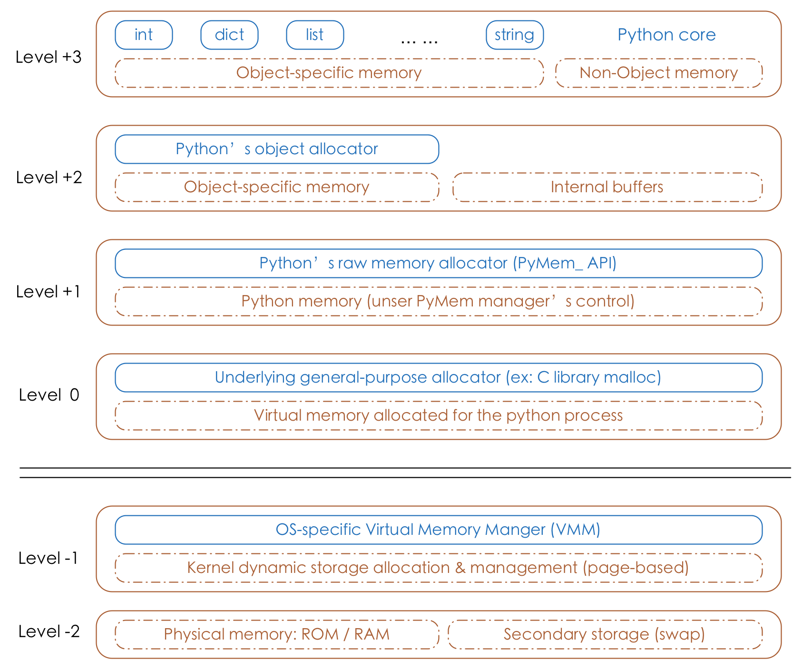
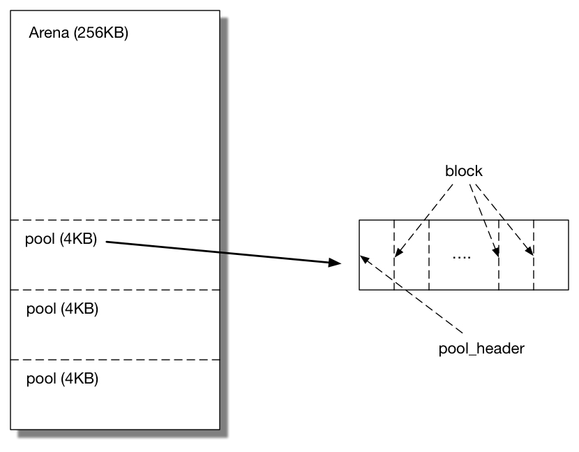

# 垃圾回收

Python的垃圾回收机制采用**引用计数**机制为主，**标记-清除**和**分代回收**机制为辅的策略。其中，标记-清除机制用来解决计数引用带来的循环引用而无法释放内存的问题，分代回收机制是为提升垃圾回收的效率。

## 引用计数

Python通过引用计数来保存内存中的变量追踪，即记录该对象被其他使用的对象引用的次数。

Python中有个内部跟踪变量叫做引用计数器，每个变量有多少个引用，简称引用计数。当某个对象的引用计数为0时，就列入了垃圾回收队列。

具体来说,在以下几种情况下,一个对象的引用计数会变为0,从而**触发内存释放**:

1. **变量重新赋值** 当一个变量被重新赋值给一个新的对象时,原有对象的引用计数就会减1。如果该对象的引用计数减为0,则该对象的内存会被*立即释放*。

2. **函数返回** 当一个函数返回时,该函数内创建的所有对象的引用计数都会减1。如果有对象的引用计数减为0,则会*立即释放*内存。

3. **代码块结束** 当一个代码块如`for`循环、`with`语句等执行完毕时,该代码块内创建的所有对象的引用计数都会减1。如果有对象的引用计数减为0,则会*立即释放*内存。

   **显式调用del** 使用`del`语句删除一个变量时,该变量指向的对象的引用计数会减1。如果引用计数减为0,则该对象的内存会被*立即释放*。

```python
>>> a=[1,2]
>>> import sys
>>> sys.getrefcount(a)  ## 获取对象a的引用次数
2
>>> b=a
>>> sys.getrefcount(a)
3
>>> del b  ## 删除b的引用
>>> sys.getrefcount(a)
2
>>> c=list()
>>> c.append(a) ## 加入到容器中
>>> sys.getrefcount(a)
3
>>> del c  ## 删除容器，引用-1
>>> sys.getrefcount(a)
2
>>> b=a
>>> sys.getrefcount(a)
3
>>> a=[3,4]  ## 重新赋值
>>> sys.getrefcount(a)
2
```

> **注意：当把a作为参数传递给getrefcount时，会产生一个临时的引用，因此得出来的结果比真实情况+1**

引用计数法有其明显的优点，如高效、实现逻辑简单、具备实时性，一旦一个对象的引用计数归零，内存就直接释放了。不用像其他机制等到特定时机。将垃圾回收随机分配到运行的阶段，处理回收内存的时间分摊到了平时，正常程序的运行比较平稳。引用计数也存在着一些缺点：

- 逻辑简单，但实现有些麻烦。每个对象需要分配单独的空间来统计引用计数，这无形中加大的空间的负担，并且需要对引用计数进行维护，在维护的时候很容易会出错。
- 在一些场景下，可能会比较慢。正常来说垃圾回收会比较平稳运行，但是当需要释放一个大的对象时，比如字典，需要对引用的所有对象循环嵌套调用，从而可能会花费比较长的时间。
- 循环引用。这将是引用计数的致命伤，引用计数对此是无解的，因此必须要使用其它的垃圾回收算法对其进行补充。

也就是说，Python 的垃圾回收机制，很**大一部分是为了处理可能产生的循环引用**，是对引用计数的补充。


引用计数能够解决大多数垃圾回收的问题，但是遇到两个对象相互引用的情况，`del`语句可以减少引用次数，但是引用计数不会归0，对象也就不会被销毁，从而造成了内存泄漏问题。**针对该情况，Python引入了标记-清除机制**。

## 标记-清除

标记-清除用来解决引用计数机制产生的循环引用，进而导致内存泄漏的问题 。 循环引用只有在容器对象才会产生，比如字典，元组，列表等。

顾名思义，该机制在进行垃圾回收时分成了两步，分别是：

- 标记阶段，遍历所有的对象，如果是可达的（reachable），也就是还有对象引用它，那么就标记该对象为可达
- 清除阶段，再次遍历对象，如果发现某个对象没有标记为可达（即为Unreachable），则就将其回收

```shell
>>> a=[1,2]
>>> b=[3,4]
>>> sys.getrefcount(a)
2
>>> sys.getrefcount(b)
2
>>> a.append(b)
>>> sys.getrefcount(b)
3
>>> b.append(a)
>>> sys.getrefcount(a)
3
>>> del a
>>> sys.getrefcount(b)
3
```

对象之间会通过引用（指针）连在一起，构成一个有向图，对象构成这个有向图的节点，而引用关系构成这个有向图的边。从root object出发，沿着有向边遍历对象，可达的（reachable）对象标记为活动对象，不可达（unreachable）的对象就是要被清除的非活动对象。所谓 root object，就是一些全局变量、调用栈、寄存器，这些对象是不可被删除的。


我们把小黑圈视为 root object，从小黑圈出发，对象 1 可达，那么它将被标记，对象 2、3可间接可达也会被标记，而 4 和 5 不可达，那么 1、2、3 就是活动对象，4 和 5 是非活动对象会被 GC 回收。

上面描述的垃圾回收的阶段，会暂停整个应用程序，等待标记清除结束后才会恢复应用程序的运行。**原因是GIL的存在，当GC运行的时候，会抢python解释器锁，其他线程处于阻塞状态，会降低python的工作效率。**

标记清除的优点在于可以解决循环引用的问题，并且在整个算法执行的过程中没有额外的开销。缺点在于当执行标记清除时正常的程序将会被阻塞。另外一个缺点在于，标记清除算法在执行很多次数后，程序的堆空间会产生一些小的内存碎片。**为了减少应用程序暂停的时间，Python 通过“分代回收”(Generational Collection)以空间换时间的方法提高垃圾回收效率。**

## 分代回收

分代回收是基于这样的一个统计事实，对于程序，存在一定比例的内存块的生存周期比较短；而剩下的内存块，生存周期会比较长，甚至会从程序开始一直持续到程序结束。生存期较短对象的比例通常在 80%～90%之间。 因此，简单地认为：对象存在时间越长，越可能不是垃圾，应该越少去收集。这样在执行标记-清除算法时可以有效减小遍历的对象数，从而提高垃圾回收的速度，**是一种以空间换时间的方法策略**。

Python将所有的对象分为年轻代（第0代）、中年代（第1代）、老年代（第2代）三代。所有的新建对象默认是 第0代对象。当在第0代的gc扫描中存活下来的对象将被移至第1代，在第1代的gc扫描中存活下来的对象将被移至第2代。

> gc扫描次数（第0代>第1代>第2代）

当某一代中被分配的对象与被释放的对象之差达到某一阈值时，就会触发当前一代的gc扫描。当某一代被扫描时，比它年轻的一代也会被扫描，因此，第2代的gc扫描发生时，第0，1代的gc扫描也会发生，即为全代扫描。

```text
>>> import gc 
>>> gc.get_threshold() ## 分代回收机制的参数阈值设置
(700, 10, 10)
```

- 700=新分配的对象数量-释放的对象数量，第0代gc扫描被触发
- 第一个10：第0代gc扫描发生10次，则第1代的gc扫描被触发
- 第二个10：第1代的gc扫描发生10次，则第2代的gc扫描被触发

## GC触发

1. 主动调用gc.collect()

   ```python
   # pip install objgraph
   # objgraph.count("Person") # 计算垃圾收集器跟踪的具有给定类名的对象的数量。
   import objgraph
   
   
   class Person:
       pass
   
   
   class Dog:
       pass
   
   
   p = Person()
   d = Dog()
   
   # 手动制造循环引用，在这种情况下引用计数器机制无法处理释放
   p.pet = d
   d.master = p
   
   # 垃圾回收机制默认是开启的，但是当前达不到触发条件
   del p
   del d
   
   # 打印当前垃圾回收器里，由Person类、Dog类所产生的对象有多少个
   print(objgraph.count("Person"))  # 1
   print(objgraph.count("Dog"))  # 1
   
   # 手动触发垃圾回收
   import gc
   
   gc.disable()  # 手动触发垃圾回收是无关垃圾回收机制是否开启的
   gc.collect()  # 无参数则代表收集0代1代和2代所有的垃圾
   print(objgraph.count("Person"))  # 0
   print(objgraph.count("Dog"))  # 0
   
   ```

2. GC达到阈值时自动触发

   1. 开启垃圾回收机制：`gc.enable()` 开启垃圾回收机制（默认开启）
      1. `gc.disable()`：关闭垃圾回收机制
      2. `gc.isenabled()`：判定是否开启
   2. 达到了垃圾回收的阈值，参考上一节

3. 程序退出时（一次性全部退出）

## 到底什么时候释放内存

- [Python 分配器 - memray --- Python allocators - memray (bloomberg.github.io)](https://bloomberg.github.io/memray/python_allocators.html)
- [10.3 CPython 内存分配器 | CPython 实现原理 (gitbook.io)](https://hai-shi.gitbook.io/cpython-internals/10-memory-management/10.3-the-cpython-memory-allocator)
- [pymalloc — 从源码看 Python 对象分配器的实现 | Zee's Book (nodefe.com)](https://nodefe.com/implement-of-pymalloc-from-source/)

上文提到**引用计数为0，立即释放内存**，其实是不准确的。

当一个对象的引用计数变为0时，Python就会调用它的析构函数。调用析构函数并不意味着最终一定会调用free来释放内存空间，如果真是这样的话，那频繁地申请、释放内存空间会使Python的执行效率大打折扣。因此在析构时也采用了内存池机制，从内存池申请到的内存会被归还到内存池中，以避免频繁地申请和释放动作。

那么内存池是什么？

### python内存池

#### 为什么要引入内存池（why）
既然 CPython 的底层用 C 语言实现，那为何不直接使用标准库中的`malloc/realloc/free`等函数进行内存管理呢？这是因为，当 Python 应用频繁地创建和销毁一些小的对象，那么底层就要多次重复调用 malloc 和 free 等函数进行内存分配。这不仅会引入较大的系统开销，而且还可能产生大量的内存碎片。为了解决这个问题，Python 实现了一个类似内存池的机制—pymalloc 来满足较小对象（默认256KB以下）的内存请求。

#### 内存池是如何工作的（how）

简单地说，allocator 预先向系统申请一定数量的内存空间并格式化，每当有满足条件的内存请求时，allocator 直接从这些格式化的内存中选择一块满足条件的分配给这个需求。如果预先申请的内存已经耗尽，那么 allocator 会再向系统申请更多的内存并格式化（前提是不能超过预先设置的内存池最大容量），然后分配内存。当对象被回收时，如果所占内存之前由 allocator 从内存池分配，那么回收的内存同样被归还给内存池，以供下次内存请求使用。如果应用的内存需求大于 pymalloc 设置的阈值，那么解释器再将这个请求交给底层的 C 函数来实现。

综上，Python 的内存管理是分层的，不同的层次使用不同的内存分配机制。我们先来看下 CPython 的内存架构图：



python的对象管理主要位于Level+1~Level+3层

- 第`-1`层，第`-2`层：由操作系统特定的虚拟内存管理器控制（OS-specific virtual memory manger(VMM)）
  - （第` -1`层）：内核动态存储分配和管理
  - （第` -2 `层）：物理内存（ROM / RAM） + 二级存储
    - ROM（只读存储器，Read-Only Memory）：用于存储计算机或其他电子设备的固件和固定数据的存储设备。常用于存储计算机的引导程序（BIOS）。与RAM不同，ROM中的数据通常无法被修改。
    - RAM（随机访问存储器，Random Access Memory）：用于存储正在运行的程序和数据的临时内存存储设备。常用于计算机快速读取和写入数据。RAM是易失性的，断电时数据会丢失。
    - 二级存储（交换，Secondary Storage）：指非易失性的大容量存储设备，如硬盘驱动器（HDD）或固态驱动器（SSD）。它用于长期存储数据、文件和操作系统。与RAM不同，二级存储的数据在断电时不会丢失。

- 第`0`层：由C标准库中底层分配器（underlying general-purpose allocator）的malloc、free进行内存分配和内存释放；

- 第`+1`层：当申请的内存 >256KB(可设置) 时，内存分配由 Python 原生的内存分配器（raw memory allocator）进行分配，本质上是调用C标准库中的malloc、realloc等函数。

- 第`+2`层：当申请的内存 <256KB(可设置) 时，内存分配由 Python 对象分配器（object allocator）实施。

- 第`+3`层：用户使用对象的直接操作层。特点：对于python内置对象（如：int、dict、list、string等），每个数据类型都有独立的私有内存池，对象之间的内存池不共享。如：int释放的内存，不会被分配给float使用。

#### 内存池的数据结构

pymalloc 把“内存池”主要抽象成用3种数据结构表示： arena， pool 和 block。其中一个 arena 包含若干个pool，每个 pool 又由若干个大小相等的 block 组成。每当应用申请一个对象，allocator 将一个满足对象大小的 block 从它所在的 pool 上“摘下”分配给它，并在对应的 pool 中标记该 block 已分配。当对象被销除时，该 block 将归还给相应的 pool。

 3种数据结构的关系如下图所示：



为了更好的解释这种情况，我们来做个类比：你可以想象有一个 CPython 足球俱乐部的主场体育场。为了帮助管理人群，CPython 足球俱乐部实现了一个系统，这个系统将体育场分为 A 至 E 区，每个区都有 1 至 40 排的座位：

在体育场前端，第 1 至 10 排是较宽敞的高级座位，每排有 80 个座位。在体育场后端，第 31 至 40 排是经济舱座位，每排有 150 个座位。

Python 内存分配算法也具有类似的特点：

- 就像体育场有座位一样，`pymalloc` 算法中也有 **block**；
- 就像座位可以是高级、普通和经济型，这些内存块也都是一系列固定大小的。你不能带上自己的躺椅；
- 就像同样大小的座位被排成一排一样，也需要将同样大小的内存块放入 **pool** 中。

核心存储单元会记录 block 存储的位置和在 pool 中可用的 block 数量，这与体育场分配座位类似。当体育场一排满员后，就将使用下一排。当一个 pool 的 block 达到最大时，就会使用下一个 pool。而 pool 被分组存储在 **arena** 中，就像体育场会将数排座位分配到几个片区一样。

这种策略有以下几种优点：

1. 这种算法在 CPython 的主要应用场景（小内存且生命周期较短的对象）下有更好的性能；有助于减少频繁的内存分配和释放带来的性能开销；
2. 这种算法使用了 GIL 而不是系统的线程锁检测；
3. 算法使用内存映射（`mmap()`）而不是堆上内存分配。

缺点：

1. 可能导致内存泄漏，因为不再使用的内存块不会立即被操作系统回收。因此，开发者应避免长期保留对不再使用的对象的引用，以避免内存泄漏。


综上，我们做一下汇总：

1. CPython是基于 C 构建的，它也受到 C 中静态内存分配、自动内存分配和动态内存分配的约束。
2. Python 是一门动态类型的语言，CPython 十分依赖动态内存分配，同时借助垃圾回收（GC）和引用计数算法去保证分配的内存可以自动释放。Python 对象的内存是通过一个统一 API 自动分配得到的，并不需要 Python 开发者自己去分配内存。这种设计也意味着 CPython 的标准库和核心模块都要使用该 API 去分配内存。
3. python中大的内存占用（>256）内存分配由 Python 原生的内存分配器分配，本质上是调用C标准库中的malloc、realloc等函数
4. python中小的内存占用（<256）内存分配由 Python 对象分配器pymalloc分配
5. pymalloc分配时，采用arena， pool 和 block的数据结构设计，减少内存碎片，避免频繁内存申请和销毁操作
6. 对于引用计数归为0的引用对象，内存释放是指：内存放回内存池，也就是被内存池标记为已释放
7. 对于循环引用之后被标记为不可达对象的，在分代回收阈值到达之后，被垃圾回收放回内存池，标记为已释放
8. 内存池会复用标记为已释放的内存块以减少内存分配开销。这意味着相同大小的内存块可以多次分配和释放，而不需要每次都与操作系统进行交互。


## 内存优化

1. 降低全局变量的使用率：全局变量会一直存在到程序结束，因此会始终占用内存。若非必要，请尽可能地使用局部变量，并在不需要时尽快将其释放。
2. 避免创建非必要的对象：在Python中，创建对象是分配内存的一种方式。因此，尽量避免创建不必要的对象，并通过复用对象的方式来减少内存分配的次数。
3. 手动释放非必要的对象：采用gc.collect()进行手动强制执行垃圾回收，用来在内存敏感时（例如：内存不足）立即释放不再需要的内存。
   
