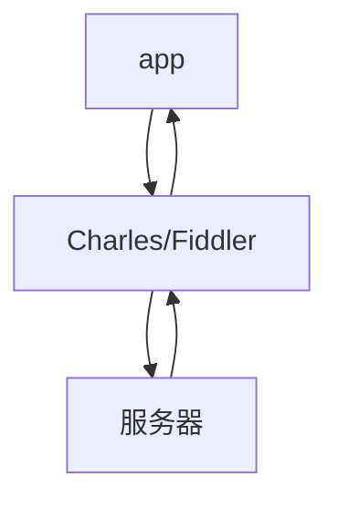

# android应用抓包/爬虫

本文采用方案为：逍遥多开器（逍遥模拟器）+ Charles + Apifox + python + Typora + 福昕高级PDF编辑器

其中网络封包截取工具试用了fiddler，https 解码失败，后采用的Charles。

<!-- more -->

## android模拟器

为了简单获取android root权限以及操作方便，建议使用android模拟器，手机的话会有一些麻烦，本文采用的是逍遥模拟器。

1. [下载逍遥模拟器](https://download.microvirt.com/download/XYAZ-Setup.exe)

2. 下载完成之后，打开逍遥多开器，并下载 **安卓5.1** 模拟器。我刚开始也是使用的默认自带的模拟器（安卓7.1），但是在https解码时失败：`Client SSL handshake failed: An unknown issue occurred processing the certificate (certificate_unknown)`,后来网上搜索发现有网友提供解释为：

   Android7.0 之后默认不信任用户添加到系统的CA证书：

   > To provide a more consistent and more secure experience across the Android ecosystem, beginning with Android Nougat, compatible devices trust only the standardized system CAs maintained in AOSP.

   也就是说对基于 SDK24（Nougat是android7.0代号） 及以上的APP来说，即使你在手机上安装了抓包工具的证书也无法抓取 https 请求。

   有2个解决办法：

   1. 使用<7.0的android版本，比如android5.1

   2. 将抓包软件的证书安装成系统证书, 参看博客：[Android 7.0 之后抓包 unknown 和证书无效的解决方案 ](https://blog.lv5.moe/p/solutions-to-certificate-invalidation-after-android-7)；但是这个对我不生效，因为`/system/etc/security/cacerts/`目录是只读的

      ```powershell
      PS C:\Users\zhao_> adb shell
      root@VOG-AL00:/ # mount
      ... 省略 ...
      /dev/block/sda6 /system ext4 ro,relatime,data=ordered 0 0
      ... 省略 ...
      ```

      注意这里的`ro`,就是read only. 所以只有第一条路可以走了。

      不过文章的解决办法应该可以使用的：

      ```powershell
      PS C:\Users\zhao_> adb shell
      root@VOG-AL00:/ # cd /system/etc/security/cacerts/
      root@VOG-AL00:/system/etc/security/cacerts # ls -l
      -rw-r--r-- root     root         4767 2022-08-02 13:32 00673b5b.0
      -rw-r--r-- root     root         4919 2022-08-02 13:32 02b73561.0
      -rw-r--r-- root     root         7142 2022-08-02 13:32 03f2b8cf.0
      ... 省略 ...
      ```

3. 注意

   1. 安装目录需要留有足够空间，一个android系统需要1.3G左右，安装完成之后，总共的空间估计要到5G
   2. 逍遥模拟器支持拖拽apk文件进行应用安装

## Charles

Fiddler和Charles的功能大同小异，基本上都是抓包、断点调试、请求替换、构造请求、代理功能；主要区别：Fiddler只能运行在Windows平台，而Charles是基于Java实现的，基本上可以运行在所有主流的桌面系统。

Fiddler和Charles的原理都一样：中间人攻击（man-in-the-middle）。

应用的正常工作是需要和服务器进行数据交互的，即：app端向服务器端去发送请求，服务器作出响应。但是我们可以在app和服务器之间塞一个中间人（proxy），这个中间人就是Charles（fiddler）。具体逻辑为：app发数据到fiddler，fiddler拿着同样的数据去发到服务器上。服务器作出响应，这个时候fiddler先给它拦截上，拦截完之后再给结果返回给app端。如下图：



### 安装

1. 下载： https://www.charlesproxy.com/assets/release/4.6.2/charles-proxy-4.6.2-win64.msi?k=241730e9c7，mac和linux平台，请查看[官网]([Download a Free Trial of Charles • Charles Web Debugging Proxy (charlesproxy.com)](https://www.charlesproxy.com/latest-release/download.do))
2. 安装
3. 默认30天试用期，但是有一点很烦的是，没有注册，30分钟之后就需要重启一下，难受，所以破解一下：[Charles破解工具 (zzzmode.com)](https://www.zzzmode.com/mytools/charles/)

### 配置

因为要抓https的包，所以要对https进行解码破解，此处使用的方法是：自签名证书。

1. 查看本地PC的地址，比如：10.221.101.123
2. 在中间人（Charles）安装自签名根证书：help-->SSl Proxying--->Install Charles Root Certificate; 安装到`受信任的根证书颁发机构`
3. 在Charles添加需要抓包的站点，Proxy-->SSL Proxy Settings， 勾选：Enable  SSL  Proxying,并且add 需要抓包的站点，比如：www.baidu.com/443; 如果不知道该怎么添加，可以填入：*/443, 就会把所有的https都解码。
4. 在android模拟器上修改网络配置，设置代理为：主机名：10.221.101.123，端口：8888； 设置完成之后，会在Charles弹出窗口允许连接，此处点击：Allow
5. 在android模拟器上打开浏览器，输入：`chls.pro/ssl`,即可下载证书并且安装

## 抓包

说到抓包，最有名的就是tcpdump+wireshark。那么是否可以在android环境里也是用tcpdump来抓数据包，然后使用wireshark来分析呢？

答案是可以的。

### 在android内使用tcpdump

- tcpdump下载。逍遥模拟器的android 5.1环境自带了tcpdump，位于：`/system/xbin/tcpdump`。如果是手机的话，需要下载专门为arm架构的版本，下载地址：[tcpdump Binary Downloads (32 Bit) | Android tcpdump](https://www.androidtcpdump.com/android-tcpdump/downloads)
- 使用命令：`tcpdump -i wlan0 -s 0 -w /sdcard/xxxx.pcap`
- 得到抓包数据之后，可以使用wireshark打开

但是发现，https的数据包无法解析。

### 使用Charles

上文已经提到Charles可以实现解码https的数据包。

配置好android模拟器和Charles，就可以开始抓包了。

重点查看右侧Contents内的数据，如果内容不对，可以参看Overview-->Notes，正常情况下，没有这个字段。

## Apifox

抓到包之后，可以分析得到一个请求的以下参数：

1. host
2. port
3. url(path/param)
4. http method(post/get/put/delete)
5. request header
   1. Content-type
   2. authorization
6. request body

收集到以上参数之后，就可以在apifox上构建接口文档，可以开心的导出openAPI/swagger或者团队分享等。

## python爬虫

经过抓包和Apifox的整理，我们可以清晰的得到我们想要的数据以及接口信息。那么就可以上代码了。一般使用urllib3或者requests包，来发请求，整理数据之后，写入txt文本、word文档、excel文档等，甚至是数学分析得到一些图表。

作者君是想要爬取一个考试网站的信息，并且按需要整理一些题目，然后打印出来。所以通过python代码整理数据之后，以markdown语法输出到txt文本。然后在把这txt重名为.md文件，使用typora打开

```markdown
... 省略 ... 
1. 简述毛泽东思想的科学内涵。
   - 毛泽东思想是马克思主义中国化第一次历史性飞跃的理论成果，是马克思列宁主义在中国的运用和发展，是被实践证明了的关于中国革命和建设的正确的理论原则和经验总结，是中国共产党集体智慧的结晶。其含义主要包括：第一，毛泽东思想是以马克思列宁主义原理作指导、在解决中国革命和建设实际问题中形成的理论体系，是中国化的马克思主义。第二，毛泽东思想是被实践证明了的正确的理论原则和经验总结。第三，毛泽东思想是中国共产党集体智慧的结晶，毛泽东是这个理论体系的主要创造者。
1. 简述毛泽东思想的历史地位。
   - 毛泽东思想的历史地位：毛泽东思想是中国共产党和中华民族宝贵的精神财富，它将长期指导我们的思想和行动。
   - （1）毛泽东思想是马克思主义中国化第一个重大理论成果。
   - （2）毛泽东思想是中国革命和建设的科学指南。
   - （3）毛泽东思想是中华民族宝贵的精神财富。
... 省略 ... 
```

## typora

typora打开之后，看起来就比较整齐了，然后导出pdf。导出word的话格式不太好看。

## 福昕高级PDF编辑器

导出的pdf文件使用福昕高级PDF编辑器打开，然后使用书签-->选项-->创建新的基于书签结构的目录页,即可 生成目录。可以使用页眉页脚等添加页码。


完结，撒花~


