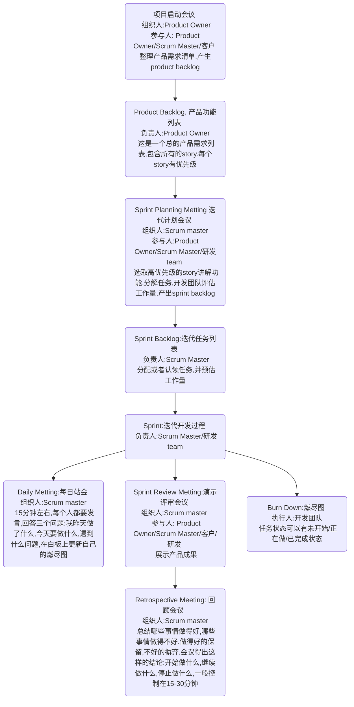

敏捷开发是一种以人为核心、迭代、循序渐进的开发方法。在敏捷开发中，软件的构建被切分成多个子项目，各个子项目的成果都经过测试，具备集成和可运行的特征。换言之，就是把一个大项目分为多个相互联系，但也可独立运行的小项目，并分别完成，在此过程中软件一直处于可使用状态。
<!-- more -->

## 什么是敏捷开发

从本质上讲，敏捷（Agile）并不是开发方法，而是一种理念。对于项目管理而言，敏捷是一个全新的术语，敏捷强调在软件研发过程中持续性的根据用户反馈和需求优先级来发布新版本，不断进行迭代，让产品逐渐完善。

在数十年前，瀑布式项目管理是软件研发的主流方法，在研发过程中，团队成员将会花大把的时间和精力在项目前期去收集资源和信息，然后基于这些去做产品设想和研发规划。

相比瀑布基于线性、可预测性地去开发产品，研发人员更想要能够灵活管理用户反馈、Bug和需求的方法。这也就是敏捷方法出来以后受欢迎的原因。

### [敏捷软件开发宣言](http://agilemanifesto.org/iso/zhchs/manifesto.html)

> 个体和互动 高于 流程和工具
> 工作的软件 高于 详尽的文档
> 客户合作 高于 合同谈判
> 响应变化 高于 遵循计划
>
> 也就是说，尽管右项有其价值，
> 我们更重视左项的价值。

总结为：

1. 以人为本：重视个体间的合作互动
2. 目标导向：我们最终交付的是“可使用的软件”，而不是一堆繁重的文档
3. 客户为先：理解客户需求，与客户合作
4. 拥抱改变：客户会在不断变化需求的过程中明晰真正需要的，因此敏捷需要拥抱变化

尽管如此，这四项价值观并不意味着我们就该放弃工具、文档和计划。因为它们对研发结果依然有非常重要的价值，只是相比之下，我们应该关注更核心的事物：人、产品模型、协作和迭代。为了让这四项原则变得简单易懂好执行，他们又将写了[敏捷开发12项原则](http://agilemanifesto.org/iso/zhchs/principles.html)作为指导：

1. 我们最重要的目标，是通过持续不断地及早交付有价值的软件使客户满意。
2. 欣然面对需求变化，即使在开发后期也一样。为了客户的竞争优势，敏捷过程掌控变化。
3. 经常地交付可工作的软件，相隔几星期或一两个月，倾向于采取较短的周期。
4. 业务人员和开发人员必须相互合作，项目中的每一天都不例外。
5. 激发个体的斗志，以他们为核心搭建项目。提供所需的环境和支援，辅以信任，从而达成目标。
6. 不论团队内外，传递信息效果最好效率也最高的方式是面对面的交谈。
7. 可工作的软件是进度的首要度量标准。
8. 敏捷过程倡导可持续开发。责任人、开发人员和用户要能够共同维持其步调稳定延续。
9. 坚持不懈地追求技术卓越和良好设计，敏捷能力由此增强。
10. 以简洁为本，它是极力减少不必要工作量的艺术。
11. 最好的架构、需求和设计出自自组织团队。
12. 团队定期地反思如何能提高成效，并依此调整自身的举止表现。

如果我们把这些原则和遇到的问题对号入座，很快我们就会发现，这12项原则正是对应了客户期望。比如，客户不会关心开发文档写的怎么样，他们更感兴趣交付的成品能干什么；他们不在意你的开发计划，他们希望你能立马交付；昨天他们想要修个BUG，而不是等到下次版本更新。

我们总会遇到需求多样化的客户，而这时，敏捷能够确保你在研发过程中始终将用户需求作为核心。

### 敏捷的优势

敏捷这一理念起源于20世纪90年代，由众多轻量级软件开发方法演化而来，它更侧重于灵活性、持续改进和速度。敏捷开发的出现让不喜欢线性瀑布式开发的项目经理有了新的选择。

敏捷有这几大优势：

- 拥抱改变：通过缩短规划周期，在项目期间能够灵活的做出调整变更。因此敏捷总会有机会来重新整理产品客户需求，让团队在几周内调整项目方向。
- 无需非常清楚最终目标：敏捷对于没有明确定义最终目标的项目是非常有利的。随着项目推进，目标将会变得更加清晰，开发过程可以很容易地适应不断变化的需求。
- 更快速、高质量的交付：将项目分解为不同的迭代（可管理单元），让团队能够专注于高质量的开发、测试和协作的环节。每次在迭代中的测试都将意味着我们能够更快的发现问题和解决问题。并且我们可以通过高频的迭代交付高质量的软件。
- 注重团队意识：敏捷非常强调当面沟通和高频沟通的重要性。团队成员在一起工作中相互了解、各司其职。
- 听取客户的意见：客户在项目进行中将会看到很多潜在可交付的软件版本，听取他们的想法，从中获取对产品迭代有利的意见。同时对他们而言，通过与项目团队的合作可以增加归属感。
- 持续性迭代与改进：敏捷开发鼓励用户和团队成员在整个项目中不断提供产品体验反馈，从中吸取经验，为后续版本的迭代提供基础。

### 敏捷的缺点

通常我们认为敏捷的灵活性在整个项目中起积极作用，但它也互有利弊。产品交期难以确定，可视化文档可能被忽视，甚至连最终交付的产品与初衷大相径庭。

敏捷的缺点如下：

- 项目规划不太具体：有时很难确定软件的交期。虽然敏捷是基于时间节点来进行交付，但项目经理会不断调整任务优先级，导致原本该交付项目跳票。同时，项目中任何新增用户需求都会花费额外的时间，从而延长整个项目进度。
- 对项目成员的能力要求高：敏捷团队通常很小，所以需要团队成员熟练掌握各个领域的技能。同时，他们还得对选用的敏捷方法无异议。
- 研发阶段时间压力大：团队投入全力进行研发是敏捷最成功的环节。在整个敏捷中需要项目成员积极参与、相互协作，但比传统的开发方法更耗时。这也意味着需要研发团队明确给出各阶段时间点并且准时交付。
- 文档可能会被忽视：敏捷宣言提倡用软件替代各类纸质文档来进行管理整个过程，因此团队成员可能会不再重视文档。虽然纸质文档本身并不会影响项目是否成功，但团队还是得在文档和用软件进行讨论之间找到平衡点。
- 最终产品可能与初衷大相径庭：最初的敏捷项目可能没有一个明确的计划，因此最终产品看起来可能与最初的目标完全不同。由于敏捷非常灵活，所以可以根据不断变化的客户反馈来添加新的迭代，这可能会导致最终的交付成果大不相同。

### 敏捷开发适合什么项目

如果用一句话来简单认识一下敏捷开发这四个字，可以这么说：一种应对快速变化需求的软件开发能力，即：**快速试错和拥抱变化**。

1. **产品复杂/新颖，不断有新的需求变化和增加**

   当产品的开发受市场影响较大时，业务需求的变动就十分常见了，为了不影响项目开发进度，需求管理必不可少。有些团队会一个个排需求、做需求，而敏捷开发是通过任务分解把工作拆分为半天到几天的工作量，然后制定里程碑时间点，将复杂的需求细化成一个个小任务，再根据轻重缓急梳理优先级，简单快捷地帮助开发人员化繁为简，提高效率。

2. **团队庞大，沟通协作效率低**

   有时一款新产品的开发，需要多部门联动协作，然而每个成员的岗位和职责不同，所以每个人关注的项目信息不一样，关注信息的频率其实也不一样，有的比较频繁，有的则可能整个项目过程就只需沟通两三次。由于每个人的习惯不同，所以他们获取信息的手段也不太一样，有些人喜欢微信、QQ，有些人喜欢邮件，还有些人喜欢以会议的形式获取信息。这就导致了团队内部沟通效率低下，许多重要的信息难以实时传递。

3. **希望高效地管理开发进度**

   产品经理为了掌握项目的进展，掌握各项工作的状况，就必须对项目过程进行监控和跟踪。只有这样，出现了问题，才能及时进行资源调整和进度计划调整，重新规划某一个任务开始和结束的时间，并记录实际的进度情况。

### 敏捷能够用于非IT的项目？
敏捷虽然一般来说是为软件开发而创建的，但它依然可以被用于其他许多项目和行业。

当我们用敏捷开发落地其他项目和行业时，需要明确一点，敏捷开发是源于精益生产和组织学习的原则。而这两项原则并不是一定得基于软件才能落实的，同理敏捷也一样。而敏捷中用的方法，比如每日站会和可视化管理，对于任何行业都非常容易上手。

目前用敏捷方法落地非IT的案例并不多，但也不至于完全没有。例如，孤独星球的合伙律师凯特·沙利文用敏捷方法，使用白板和看板、站会、按优先级服务、周期性迭代和定期回顾，改变了其法律事务的服务交付流程。

当根据需求找到合适的方法，我想我们一定有机会在非IT项目中用上敏捷方法。可以先尝试用白板和看板、每日站会或周会，看看团队的反馈如何。

### 如何开始着手使用敏捷
我们可以先从每日站会来快速切入来实施敏捷。每日站会由于很容易融入你所用过的其他项目管理方法中（甚至包括瀑布开发），所以项目成员不需要经过特意的培训或是知识储备，大家每天大概花上10分钟左右时间，让每个人讨论下近两天工作进度和遇到的问题就可以。

如果你希望一次性完全切换到敏捷，我们可能得先了解为什么研发团队和整个项目组需要做出这种调整和改变。比如，有哪些任务是研发团队认为该做和不该做的，他们想要改善什么等等。然后再进行敏捷评估，全面了解所用的人员、技能和技术。

在开始敏捷时，对于方法的选择上并没有完全的对错，因为敏捷的本质就是灵活的。所以我们只要选择适合您和团队的方法就好了。

## 怎么知道敏捷（Agile）和团队成员是否三观相合

敏捷虽然听起来光鲜亮丽，但不是所有项目都能用敏捷来做。

敏捷在公司里投入使用后可能与预想的结果背道而驰。敏捷意味着快速推进项目，也就是说并不是所有事情都是按部就班。因此，我们得知道在这种快速变化的环境下，团队是否能够适应变化。

所以在我们部署使用敏捷前，先来点前戏试试看。在使用前，我们可以先问自己5个问题：

1. 你是否会愿意接手目标不明确的项目？

敏捷项目管理中有句话叫做：快速失败。比如我们接手了一个连最终产出都不明确的项目，首先我们会先交付最小模型产品，这时我们得做好被质疑的准备。毕竟没人知道要做出怎么样的产品，所以我们的最小模型的产品很可能是个怪胎。在与客户反复测试后，我们会才会逐步了解他们的真实需求，这时候我们离成功又近了一步。

2. 你会如何规避项目风险？

就像我们前面提到的，敏捷提倡不断从犯错中积累学习并持续迭代。如果我们走老路，用传统项目管理的方法来推进的话，我们会要承担更大的风险。当然就算我们开始敏捷之后，也要准备好随时响应未知问题。

3. 你的团队能有多灵活？

作为项目经理，我们的责任是和客户一起把产品做的更好。这么做很可能和设计、研发、其他成员的想法背道而驰。这时我们需要找主心骨聊一聊，是否愿意放下老套路，根据用户需求来调整想法、重新规划方向。

4. 公司阶层制度严格吗？

敏捷的其中一项原则不仅是和用户一起工作，研发成员的身份也会发生变化。你们公司的文化开放吗？是否能接受扁平和开放的管理方法？

5. 你怎么衡量进度？怎么定义成功？

用敏捷来管理项目能够帮我们逐渐进步的同时也督促我们将产品做得更好。如果因为突发灵感而放弃正在执行的任务，那么敏捷将毫无意义。我们先花些时间来看看团队是怎么看待进步和成功。然后再来看我们是不是离最终目标一步步的更近了？

## 敏捷开发方法论

敏捷开发有很多方法论，以下讨论一些比较常用的，包括scrum、kanban、srumban和TDD。

### scrum

不同于瀑布模型将开发过程划分为需求、设计、编码、测试等阶段，Scrum将整个开发过程分为多次迭代（称为Sprint，冲刺），一般为期2～4周，最常见的为**2周**。Scrum并非以一段时间集中完成一个过程，而是将所有过程中必须的每一部分集中在这段时间内完成。需求、设计、编码、测试、上线都必须在一个迭代中完成，每个迭代必须产生一个可以工作的软件。

Scrum有一套其独特且固定管理方式，从角色、工件和不同形式的会议三个维度出发，来保证执行过程更高效。例如在每次sprints开始前会确立整个过程：迭代规划、每日站会、迭代演示和回顾。并在sprint期间用可视化工件（看板kanban或燃尽图burndown）确认进度和收集客户反馈。

#### 三个角色

在Scrum中有三个特定的角色。他们是：

- 产品所有者（Product Owner）：一般由产品经理担任，负责规划产品，并将研发这种产品的愿景传达给团队。产品负责人需要整理产品需求清单（backlog），关注市场需求的变化来调整产品需求优先级，确认下次迭代需要交付的功能。与团队、客户、利益相关方持续保持沟通和反馈，保证每位项目成员了解项目意义和愿景。
- Scrum Master：Scrum Master帮助团队尽其所能地完成工作。例如：组织会议，处理遇到的障碍和挑战，与产品经理合作，在下次迭代前准备好backlog，确保团队遵循Scrum流程。Scrum Master对团队成员在做的事情没有权力，但对这一过程拥有权力。例如，Scrum Master不能告诉某人该做什么，但可以提出新的sprint。
- Scrum团队：Scrum团队由五到七名成员组成。与传统的开发团队不同，成员们没有固定角色，比如会由测试人员来做研发。团队成员间相互帮助、共享成果，旨在完成全部的工作。Scrum团队需要做好整体规划，并为每次迭代划分合适的工作量。

#### 五个会议

Scrum 整个开发过程分为五个会议:

1）待办事项整理会议（Backlog Grooming Meeting）

迭代计划会议开始之前3天召开，Product Owner与Scrum Master必须参加，关键开发者或架构师需要参加；时间控制在30分钟到1小时。

由Product Owner将一批希望团队在下次迭代时实现的用户故事，按照实现顺序描述给在场的团队成员，Scrum Master与在场成员分析用户故事，明确指出团队认为需求不明确的地方，Product Owner现场记录，会后补全，Scrum Master与架构师，还有在场成员分析用户故事需要包含哪些技术任务，Scrum Master先把子任务建立，方便迭代计划会议的时候团队可以更准确地预估任务故事点。

会议结束时，Product Owner确保在迭代计划会议开始之前团队提出的问题都能被解决，如果团队发现需要加强或是完善的地方，Product Owner还有两到三天的时间可以补强，而不是浪费迭代计划会议的时间去做这件事情。

2）迭代计划会议（Sprint Planning Meeting）

产品负责人建立产品功能列表（Product Backlog）。产品功能列表是一组条目化需求，它必须从客户价值角度描述，并按优先级排序。

Scrum Master召集相关人员召开迭代计划会，迭代计划会在每个迭代第一天召开，目的是选择本次迭代的Backlog和估算本次迭代的工作量。

产品负责人逐条讲解最重要的产品功能，开发团队共同估算Backlog所需工作量，直到本迭代工作量达到饱和。产品负责人参与讨论并回答和需求相关的问题，但不干扰估算结果。队员认领任务（或由组长协商分发），独立或与别人一起完成任务；会议时间控制在1-2小时内。

3）每日站会（dailyMeeting）

团队内部利用每日立会来沟通进度，15分钟结束，开发团队利用燃尽图来展示整体进度；如无特殊原因，迭代期内无变更，在每日站会上团队成员需要回答以下3个问题：

- 昨天你做了什么?
- 今天你将要做什么?
- 你有需要帮助的地方吗?

这些都是团队成员的彼此承诺。

4）评审会（Review Meeting）

小组向产品负责人展示迭代工作结果，产品负责人给出评价和反馈。以用户故事是否能成功交付来评价任务完成情况。整个团队都需要参加，ScrumMaster、产品所有者、团队，可能还有客户，时间控制在1-2小时内。

5）反思会（Retrospective Meeting）

在每个迭代后召开简短的反思会，总结哪些事情做得好，哪些事情做得不好。做得好的保留，不好的摒弃。会议得出这样的结论：开始做什么、继续做什么、停止做什么，一般控制在15-30分钟。

#### Scrum过程中的步骤

#### Scrum优势

Scrum从高度规范的框架出发构建了特有的团队角色和团队制度，Scrum在框架上有非常的优点可以被借鉴，其中包括：

- 提高透明度和进度可视性：通过每日站会，让整个团队相互知道大家在做什么，是否有遇到问题，是否需要停止某个需求。站会可以很好的帮助项目经理提前知晓项目可能存在的问题或风险，并做好风控。
- 增加团队协作：没有项目经理能够具体告诉Scrum团队应该在何时做何事。相反，该由Scrum团队会在每次迭代规划会议上确认他们每次迭代的内容。Scrum团队在迭代阶段互相合作，了解迭代意义，并在迭代结束后来回顾如何改善协作间出现的问题，增加团队协作性。
- 拥抱改变：Scrum通过持续沟通和反馈得出客户故事，并在短时间内的实现产品迭代。因此，Scrum方法相较传统的瀑布开发更容易作出改变。例如，如果团队在某一次sprint期间得到新的用户故事，他们可以在下次迭代规划会议中提出。
- 节省成本：通过研发和测试最小模型的功能，并和产品经理、Scrum团队、利益方保持沟通，我们可以尽早发现问题所在并及时作出调整，从而帮助降低开支并提高产品交付质量。

#### Scrum的缺点

Scrum虽然由很多优点，但并不代表它是完美的。用Scrum来实施敏捷的要求也比较严苛，它要求项目经理有丰富的管理经验，要求Scrum团队有足够的交付能力（即准时交付），同时要求整个项目组成员对项目范围有准确的认识，缺点具体如下：

- 项目范围蔓延风险：由于敏捷开发没有具体交付日期，客户可能会不间断要求项目组增加新的功能，导致超出项目原本的范围。
- 对团队成员要求高：团队需要事先熟悉Scrum的原则才能更好的去实施。由于Scrum对团队的角色没有非常准确的定位，因此最好能有有经验的成员来做指导。另外每天开站会意味着项目过程中要尽量减少人员流动性。
- Scrum Master可能毁掉一切：Scrum Master与项目经理不同，Scrum Master对团队没有权力。他们需要信任他们正在管理的团队，并且不对团队做过多的干涉。如果Scrum Master试图控制团队，那么项目宣告失败。
- 任务定义不准确带来的影响：如果项目定义不准确，那么项目成本和时间就很难估算。另一方面，如果不清楚项目目标，相应的计划会变得难以执行，冲刺阶段也会花更多的时间。

### kanban看板

kanban是一种可视化的管理系统， 目的是对生产过程做出持续，渐进的改善。

#### 名词释义

看板方法的英文为kanban，和中文的看板正好音同，这个当然不是巧合了，看板起源于日本，它的日文注音也正好是'kanban'，在日文中它也可以写作汉字“看板”，当然也可以写成日本假名。但是这两个意思完全不同，写作看板时接近“可视化的板”，而日文假名则为“信号卡”。

软件开发中的看板应该更接近于信号卡，但是在国内，大家往往因名生义，把它看做可视化的板，所以往往忽略了其本质的意义，这也是看板系统在国内被普遍误解的一个重要原因。但是在国外，英语有对应的可视化的板---“kanban board”。所以我们称其为看板墙。

#### kanban 模型和实践

kanban最简单的模型是：一般由3列构成，从左到右依次是，**TODO**，**DOING**和**DONE**。

这样的看板存在一些缺陷：

1. 没有在制品（work-in-progress, WIP）显示，不能反映出工序之间在制品的**积压**情况。
2. 无法确定瓶颈

为了优化和解决以上问题，比较完善的看板模型设计如下：

- 在制品（WIP）指的是在某一环节内所有的工作--包括进行和等待的（上图中红色数字就是在制品）。

- 环节内在制品数目小于这个数目的，可以从上一个环节拉入新的工作，否则不允许拉入。

- 控制在制品数量可以使环节内并行工作降低，单个工作项的完成加等待时间缩短，工作项从进入看板到交付的时间也会缩短。因此，加速用户价值的流动。而且更重要的是，控制在制品数量可以帮助团队暴露问题和瓶颈。举个例子，上图中如果测试的在制品数目达到上限，就不能在拉入新的工作了，团队应该聚焦于完成当前的工作，及时处理出现问题，如果测试这里长期积压，那么说明这个地方已经成为了团队工作的瓶颈，更早的 暴露问题所在。

那么，软件开发中kanban的一般实践是什么呢？

| 需求池 WIP | 设计/分析 WIP | 待开发 WIP              | 开发中 WIP | 已完成 WIP | 测试中 WIP | 测试完成WIP | 发布 WIP |
| ---------- | ------------- | :---------------------- | ---------- | ---------- | ---------- | ----------- | -------- |
|            |               |                         |            |            |            |             |          |
|            |               |                         |            |            |            |             |          |
|            |               | DoD(Definition of Done) |            | DoD        |            | DoD         | DoD      |

- 最好使用物理的看板，可以是一块白板或者任何干净的可以书写的墙壁；使用在线的看板工具进行备份和同步，在线工具可以提供一些统计数据，方便查看。
  - **物理看板的优势**
    - 启动快：只要团队统一意见，立刻就可以找一片“根据地”，花10分钟就可以布置好物理看板，立刻就可以把相关工作可视化。
    - 成本低：物理看板几乎不需要建设和维护成本，简单一点在某个墙上贴一些泳道条，买一些即时贴即可。100元能运行几个月。
    - 变动容易：团队刚刚开始导入敏捷，导入看板，在没有充分实践的情况下，极有可能会对看板进行变动，如：细分流程,增加“编码完成”。在物理看板上画2分钟即可完成。
  - **物理看板的劣势**
    -  没有历史数据的沉淀，缺乏整体性
    -  管理层不容易看到、不容易看懂
  - **电子看板的优势**
    - 完全基于敏捷思想而设计的；
    - 方便团队操作的，无须复杂培训的；
    - 可以根据具体实践情况，灵活变动的；
    - 可以基于之前看板数据，智能分析，并提升团队操作效率的；
    - 可以自动根据团队操作，生成各种管理报告的；
    - 可以和组织其他系统无缝结合的
- 卡片可以有多个种类，如story、task、bug等，当然一些DoD/WIP/状态等也可以使用小纸条等来标记
- 卡片的内容一般需要包含：责任人、优先级、标题、描述、起止时间、预估工作量等；可以根据卡片种类不同而不同
  - story： 故事卡片需要描述需求，需求=用户问题+应用场景+解决方案，可以使用这样的范式：`作为<角色>，在<时间/地点>，我想<做什么>，是为了<商业价值/什么目的>， 于是，我<怎么做/操作>,最后 <怎么验证>`
  - task：任务拆解，注意一个任务一般不要超过2天，应该尽可能小，以小时为单位
  - bug
- DoD(Definition of Done)：完成的定义，也是阶段之间流转的验收标准
- WIP = 2n-1(n为团队人员个数， -1 为鼓励沟通) 或者限制一个总数，而不是每个人只盯着自己的任务
- 每日站会（同与scrum）
- 回顾会（同与scrum）

#### kanban的优点

- 拉式开发，从下游向上游传递信息，达到控制。
  - 控制库存：下游需要时上游才开始生产，有效控制库存
  - 加速流动：进入生产环节的物料和半成品，很快就被拉入下一环节，实现了保证安全库存的前提下物料最快流动，提高工程的运转效率。
  - 灵活响应：用户需求变化通过看板行程的信息流快速传递至各个环节，系统能够做出快的响应。
  - 促进改善：库存降低和流动加速，能够使生产问题快速暴露，比如生产环节的质量问题很快就会被下个环境发现。

### scrumBan

结合scrum+kanban,就有了scrumBan。

1. 工作可视化：物理看板或者在线
2. WIP
3. 增加蓄水池（ready）流程，蓄水池流程也需要WIP限制
4. 优先级排序：任务不是指定的，而是按照优先级排序，一个人完成任务之后，从优先级最高的认领一个任务开始处理。
5. 不再估算任务工作量：团队关注正在做的事情，如果遇到阻塞，那么整个团队应该一起来解决。一个难以估算的，不合适的任务应该在开发之前已经经过了调研并且DoD清晰可以流转。所以应不会出现一个估值超过预期的任务发生，那么估算工作量就是没有必要的了。
6. 触发新的计划：在scrum里是以sprint为一个周期进行迭代，完成一个sprint，再从backlog获取新的需求进入sprint。而看板是拉式的，下游的任务完成并且移动，会拉取上游的任务进入。
7. 保留评审和回顾会议。这里也可以使用WIP来做改善事项控制，wip为0那么就可以开始回顾会议了。

